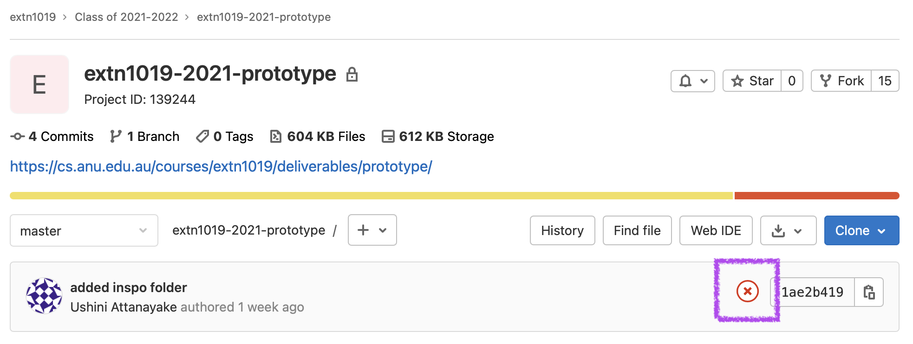

## Outline

- **Due:** Friday 22rd September 11:59pm
- **Mark weighting:** 30%
- **Template:** [template in gitlab]()
- **Submission:** submit your assignment according to the [instructions below](#submission-process)
- **Policies:** for late policies, academic integrity policies, etc. see the [policies page](/policies/)
- **Marking Criteria:** [Criteria](#marking) and [Rubric](#rubric)

## Description

It's now time for you to build a work-in-progress prototype demonstrating the
ideas and creative computing techniques you're planning to explore in your
final project (which you'll complete in time for our final _EXTN1019 Exhibition_
in mid-November).

For this deliverable (due September 22rd at 10pm) you need to produce a prototype of an _interactive_ creative computing artefact which explores a theme. The **theme** for this year's project is [_"Ways of Being"_](https://jamesbridle.com/books/ways-of-being). You will continue to refine the ideas from your prototype as you develop your final project, which you will submit next term. Your prototype submission will be comprised of two parts; 

1. the code for your prototype;
2. a video-presentation documenting your research and decision making. In your video-presentation, you must specify:
* Your interpretation of the **theme** _"Ways of Being"_
* a description of the **experience** you want to design for an audience to express your exploration of the theme (e.g. how do you want them to feel after consuming your work?)
* the **inspiration**---any art/music/books/games/creative code from other people that you're using as inspiration
* the **demo** of your prototype _in action_---showing the evolution of your artefact over time and demonstrating any user interaction you've incorporated.
* an evaluation / reflection of your development process which identifies and analyses how you decided on _this_ prototype, showing the alternative solutions you rejected  

The **demo** part is super important. Even though you are primarily submitting a video, you need to build something that works, and your video needs to show it in action. NOTE: it is vital that you submit the code too; see the [submission instructions](#submission-process) below.

## Specification {#specification}

Your prototype demo video must be:

- no less than 2 minutes long
- no more than 5 minutes long
- in HD resolution (1920x1080)
- a video file in `.mov`, `.mp4`, or `.mkv` format called either:
  - `prototype-demo.mov`
  - `prototype-demo.mp4`
  - `prototype-demo.mkv`

You must also submit the code for your prototype (through your fork of the
[GitLab template repo]({{ page.template_repo }})).

## Submission process {#submission-process}

You must submit your video _and_ code by **committing and pushing** it to GitLab by **11:59pm Friday 22 September**. You must push it to _your fork_ of the [template]({{ page.template_repo }}) (the same process we use every week in the labs).

Remember: a video file is just a file like all the other files (e.g. `.js`, `.html`) you've had in your template folder every week. To add the video to your project, you just drag the video file into the folder, run the "Commit all changes" command through the command palette in VSCode, and then push it up to GitLab as usual.

Once you've done that, it's a good idea to log into the GitLab web interface and check that it's been successfully pushed.

## Marking criteria {#marking}

The marking criteria are connected to the [course learning outcomes (LOs)](/outline/#learning-outcomes-a).

### Theme/inspiration 
**connected to LO #1 & #4 | 20%**

- how engaging is your interpretation of the theme?<br>
---does it draw the viewer in and make them want to see/hear more about your work?<br> 
is there a compelling narrative arc?

- how clearly have you shown how your prototype is inspired by/connected to prior work in creative computing?<br>
Alternatively: how have you shown your interpretation and exploration of the theme is based on prior research in _any_ field?<br> 
you can choose a field and use your creative code artefact to explore that in the context of your interpretation of the theme.

### Artistic Output 
**connected to LO #2 | 20%**

- are the foundations for an engaging artistic output (either visuals or sound/music) implemented in your prototype?

- what's the take-home message?<br>
what do you want to make the viewer/listener and feel and remember?

### Demo interaction 
**connected to LO #1 | 20%**

- how have you included _interaction_ in your prototype demo?<br>
is it clear what's going on and does your prototype appear engaging?

- is the interaction connected to the theme in a meaningful way?

### Computational Thinking 
**connected to LO #1, #2 and #3 | 20%**

- does the prototype work as it's supposed to?<br>
are there any obvious bugs/janky bits?

- tell us about your prototype development process, including alternative prototypes you rejected (and why), and how you refined and improved your prototype over time

### Presentation 
**connected to LO #1, #2, #3 and #4  | 20%**

- is the presentation clear, with a logical structure, easy-to-follow explanations of the how the theme has been interpreted, including both the _what_ and the _why_ of your prototype's design?

- gestalt: the whole is greater than the sum of the parts.<br>
How do your prototype, interaction, demonstration and presentation work together towards a consistent interpretation of the theme.

:::info
Note: the mark is for mostly for your video presentation, not the code itself. However, you
must submit the code as well (as [stated above](#submission-process)) to show us
the work that your video is based on---if you don't push the code that will be
considered a submission which does not [conform to the spec](#spec-non-conformance).
:::

## Prototype Demo Video Assessment Rubric {#rubric}

| | A Grade<br>(9-10) | B Grade<br>(7-8) | C Grade<br>(5-6) | D Grade<br>(3-4) | E Grade<br>(0-2) |
| :---     | :---    |  :---    | :---     | :---     | :---    |
| **Theme / Inspiration (20%)**    |  |  |  |  |  |
| **Engaging Theme**<br>**LO#4** *10%*<br>how engaging is your interpretation of the theme---does it draw the viewer in and make them want to see/hear more about your work? is there a compelling narrative arc? | there is a unique and surprising interpretation of the theme, which is highly engaging, with a strong narrative arc and which drives the whole demonstration and video presentation | there is a clear, creative and engaging interpretation of the theme with some development of a narrative arc. The connection to the demo needs further development | there is a clear interpretation / elaboration of the theme: the engagement and connection to the demonstration need further development | the theme is referenced, but an interpretation  or elaboration of the is not developed  | the theme is not clearly represented |
| **Connection to Creative Computing**<br>**LO#2 and #4** *10%* <br> how clearly have you shown how your prototype is inspired by/connected to prior work in creative computing? | insightful and well researched discussion of prior work (in creative computing or specifically identified field), including critical analysis of how the the prior work relates to your interpretation of the theme and to the prototype | critical analysis of prior work, including a general discussion of how the the prior work relates to the theme and/or prototype  | analysis of prior work, including some identification of how the the prior work relates to the theme or prototype  | minimal identification of prior work, no discussion of how it relates to the theme  | very limited or no mention of prior work
| **Artistic Output (20%)**    |  |  |  |  |  |
| **Engaging Creative Output** <br>**LO#2** *10%*<br>are the foundations for an engaging artistic output (either visuals or sound/music) implemented in your prototype? | strong evidence of creativity to develop surprising, highly engaging and innovative responses with clear direction for developing the final project | evidence of creativity to develop innovative responses with indication of development direction for final project | evidence of critical thinking with some indication of possibilities for final project  | develops basic solutions | very limited creative output |
| **Artistic Intent** <br>**LO#2** *10%*<br>what's the take-home message? what do you want to make the viewer/listener and feel and remember? | insightfully communicates the intent of the work, using self-reflection and the needs of the audience | effectively communicates the intent of the work, using self-reflection or the needs of the audience | communicates the intent of the work, targeted for an audience | limited evidence about the intent of the work | very limited or no evidence regarding the take-home message |
| **Demo Interaction (20%)**    |  |  |  |  |  |
| **Engaging Interaction** <br>**LO#1** *10%*<br> how have you included _interaction_ in your prototype demo? is it clear what's going on and does your prototype look like fun to play with? | highly engaging, innovative and effective interaction, with a high level of attention given to demonstrating the prototype  | engaging and effective interaction, with attention given to demonstrating the prototype  | effective interaction including a demonstration of the interaction  | limited interaction, limited attempt at demonstration of interaction  | very limited interaction, and very limited (or no) demonstration  |
| **Connection between Interaction and Theme** <br>**LO#1** *10%*<br> is the interaction connected to the theme in a meaningful way? | the interaction strongly connects to the theme, and the interaction makes the thematic message stronger | the interaction connects clearly to the theme | the interaction shows some relationship to the theme: thematic connections through interaction need further development | the interaction and the theme are not clearly connected | limited interaction with no connection to the theme |
| **Computational Thinking (20%)**    |  |  |  |  |  |
| **Coding Effectiveness** <br>**LO#1 and #2** *10%*<br>does the prototype work as it's supposed to? are there any obvious bugs/janky bits? | employs critical and creative thinking, drawing on data and information to solve complex problems effectively: the polished and well-documented code works as intended | employs critical OR creative thinking, drawing on data and information to solve problems effectively: the code works effectively in most cases  | employs critical thinking, drawing on data and information to solve problems: the code works satisfactorily, but contains minor flaws  | draws on some on information in an attempt to solve problems: the code works exhibits major flaws  | the code doesn't work |
| **Prototype Evaluation**<br>**LO#1 and #3** *10%*<br>tell us about your prototype development process, including alternative prototypes you rejected (and why), and how you refined and improved your prototype over time |  evidence of prototype development is well documented, showing critical analysis and evaluation of a number of potential prototypes for appropriateness and effectiveness with clear iterative improvement and review | analysis of a number of potential prototypes and solutions explains the appropriateness and effectiveness of alternative solutions with iterative improvement | evidence shows at least 2 potential prototypes and solutions with descriptions of their appropriateness and effectiveness | describes one potential prototype with limited reference to its appropriateness or effectiveness | very limited identification of alternative solutions with no evidence of iterative improvement or review
| **Presentation and Structure (20%)**    |  |  |  |  |  |
| **Presentation and Structure**<br>**LO#2** *10%* <br> is the presentation clear, with a logical structure, easy-to-follow explanations of the how the theme has been interpreted, including both the _what_ and the _why_ of your prototype's design? | presentation has a clear, logical structure which is easy-to-follow, clearly identifying and elaborating the nature and purpose of the theme, showing insightful presentation of complex concepts, using advanced language, metalanguage, and strong use of video production skills | presentation has a clear, intuitive structure, which includes and investigation of the nature and purpose of the theme. The presentation uses appropriate language, metalanguage, and good video production skills | presentation has a clear structure. The nature of the theme is explored. The presentation uses some metalanguage appropriately, and demonstrates satisfactory video production skills | presentation lacks a clear structure or is difficult to follow. The theme is identified, but not interpreted, explored or elaborated. The presentation demonstrates basic video production skills | presentation is very difficult to follow without discussion or identification of the nature or purpose of the theme. The presentation demonstrates very limited video production skills |
| **Gestalt of Thematic Approach**<br>**LO#1,2,3,4** *10%*<br>gestalt: the whole is greater than the sum of the parts. How do your prototype, interaction, demonstration and presentation work together towards a consistent interpretation of the theme. | The presentation, demonstration and prototype exhibit strong cohesion through coding, thematic approach, and interaction design, where the final output delivers much more than the sum of the elements | The presentation, demonstration and prototype exhibit cohesion through coding, thematic approach, and interaction design, where the prototype delivers more than the sum of the elements | The prototype shows cohesion through coding and/or thematic approach and/or interaction design | The prototype, interaction design, demonstration and presentation lack cohesion  | The prototype, interaction design, demonstration and presentation have no cohesion. The result is much less than the sum of the parts |

## FAQ

:::info
In addition to these FAQ entries, we've had some good discussions on the main
Teams channel (especially around class time) so make sure
you've read through that archive as well.
:::

### Halp---what do I do if my project has a nasty red ❌ next to it in GitLab?

Your project page in GitLab might look something like this:



This red ❌ (highlighted with a purple box in the screenshot) doesn't mean that your code hasn't been pushed to GitLab, or that your code is bad, or anything like that.

It's there because there's a "check" that GitLab does (for this project
specifically, not all projects) to make sure that there's a file in the
top-level folder of your repo with one of the following filenames:

- `prototype-demo.mov`
- `prototype-demo.mp4`
- `prototype-demo.mkv`

So GitLab is basically checking if you've committed & pushed your final video
file correctly. If you have, you'll get a green ✅. It doesn't tell you anything
about whether your video is any good---it just says that there's a file in there
with (one of) the correct filename(s).

This also means it's ok to still have the red ❌ if you're just working on the
code part of your prototype and haven't uploaded the video yet. Remember---it's
good to push early and often to GitLab, just in case you spill coffee on your
laptop or some other disaster. And you don't need to worry (necessarily) about
the red ❌ now that you know what it _means_.

### How do I know if I've submitted the video file correctly?

Well, that's where the ✅/❌ thing comes in. If you've submitted a video file
with the (one of the) _exact_ filenames listed [above](#specification) then
you'll see the green ✅ after you push. If you don't see it, then you haven't.

The ✅/❌ thing doesn't do any fancy checking about the length/resolution of
your video---just that the file exists (with the correct name). But it's a nice
way to get peace of mind that at least you've pushed your file up to the server
successfully (because if you don't do that before the deadline that counts as a
late submission).

### How do I even start?

If you're not sure exactly what to cover in your demo, here are a few questions
to help you get started (note: this is not a checklist---just some stimulus
material to get the juices flowing).

- are there any artists/pieces which you've used for inspiration? is there a certain aesthetic which you gravitate towards? how will your prototype
  explore & extend the things in that work?

- is there one key _interaction idea_ that's at the heart of your
  performance/artefact? or is it about taking two separate ideas and mashing
  them together? or something else?

- what's _unique_ about your prototype---what is it that makes yours stand out
  from the crowd?

- what do you want someone who sees/hears your final project work to
  experience---what do you hope they'd tell their friends about it?

### What do you mean by "prototype"? {#what-do-you-mean-by-prototype}

You might be wondering what the difference is between this prototype and the
actual final project. [Wikipedia
reckons](https://en.wikipedia.org/wiki/Prototype) that:

> a prototype is an initial model of an object built to test a design.

So the key point is that it's something you _build_ (in code) that tests out
your design ideas. It's not expected to be anything complete or polished, but it
does need to work. It's better to build something small which works (and allows
you to see if your idea is cool/interesting/whatever) than to try and build
something really big---even "final-project sized" but not get it working.

The prototype demo video that you'll make is also a chance for you to explore
(and get feedback from your classmates) on the ideas you're kicking around and
how it might evolve as the final project performance approaches. It's even an
opportunity for you to raise open questions you have about the rest of the
design process.

It can be based on either the p5 visuals stuff (from term 2) or the Tone.js
music stuff (from term 3) or both. If you've got other ideas and you're not sure
if they fit the requirements, then ping Matthew/Simone on Teams and we can have a
chat.

### How "big" should it be? {#how-big-should-it-be}

We're not going to set any hard-and-fast "it must have this many lines of code"
rules or anything like that (lines-of-code is a [pretty bad way of measuring
productivity in coding
anyway](https://www.folklore.org/StoryView.py?story=Negative_2000_Lines_Of_Code.txt)).

Instead, here's a rule of thumb---it should be a _bit_ more sophisticated than
what you tend to come up with by the end of the lab, but doesn't have to be
_heaps_ more sophisticated than that.

### Does my prototype have to have all the parts that will be in my final project?

No, not necessarily. If your plan for the final project is something with music
_and_ visuals, you might decide for your prototype to just build the music _or_
visuals part. Or if your final project will have two "stages", you might decide
that the prototype will only include one of the stages.

Obviously your prototype still needs to be an [appropriately-sized piece of
work](#how-big-should-it-be), but it doesn't have to include _everything_ which
will be in your final project.

### How does this "prototype" deliverable relate to the final project due at the end of the year?

In terms of scope, hopefully the previous two FAQ entries have clarified what we
mean by "prototype" (vs the final project).

In terms of [marking](#marking), your prototype (30%) is marked separately from your major
project (50%). Obviously there will be some continuity between the two (you can
keep anything you build for your prototype and include it in your final project)
but the final project will have different marking criteria and rubrics and is a
separate deliverable. In general, your final project will be bigger and
more polished---it'll do more, and it'll do it better. The detailed [rubric is here](#rubric).

### Does my video need to be based around a `.ppt`?

No, you don't have to have a bunch of "slides" that you talk over the top of.
Instead, think of it more like you're a YouTuber/TikTokker showing off a cool
product that you're being paid to shill. You know, _hey guys..._

### What if my video is too big/small/long/short? {#spec-non-conformance}

There will be penalty of up to 20% if your video doesn't fit the
[spec](#specification).

If you'd like some help in figuring out if your video fits the spec or not, then
let us know _well before the deadline_ and we can help you out.

### What software should I use to make my video?

It doesn't matter---as long as it fulfils the [spec](#specification) above.
You'll need some way to record your screen (including audio, if your prototype
makes any noise), but you can cut the video together with whatever software you like.

If you don't have experience with that sort of thing, let us know _early_ so we
can help you out. "I didn't know how to make a video" is not an acceptable
excuse for late/missing submissions.

### Do I have to have my voice/face in the video?

No, you don't have to---but you can if you want. You can use text-on-screen or
voice over, it's up to you. The main thing is that it tells the story of your interpretation of the
theme, your inspiration, your development process, and a demonstration of your prototype in a clear & entertaining way. Be creative!

### Will my classmates get to see my work?

Yes, you'll get a chance to discuss your work in small groups during the first week of next term.

One of the cool things about this prototype process is seeing what everyone else
is working on and being able to give feedback & encouragement. As you have
hopefully figured out by now, we're a friendly and encouraging bunch, and (as in
all things EXTN1019) the course [code of conduct](/policies/#code-of-conduct) applies (short version: be excellent to each other).

You're not grading your classmates---you don't give them a mark, and any
discussions you have with one another isn't incorporated into the grades. The purpose
of the discussion is for you to help one another out in creating the best creative
computing work that you can.

### Can I include code/sound files/images from elsewhere in my prototype & demo video? {#referencing}

Yes, you can (although obviously if you just present something that someone else
has made without doing any work yourself then that's not enough to pass the
assignment). Whatever you use, **make sure that you reference it**. You can do
this in a comment in your code, or a short list at the end of your demo video,
or in a `references.md` file you add to your repo---it doesn't really matter.
But it **does** matter that you reference it somehow, because otherwise it
counts as plagiarism, and that's something which is taken pretty seriously at
the ANU and the penalties can be severe.

This isn't meant to be scary, I'm sure you all know how to reference things and
as long as you don't try and pass of work by others as your own you'll be ok.
But if you're not sure if/how to reference something then you need to ask us
(early!) on the Teams channel, because "whoops, I forgot" is not an acceptable
excuse for not providing a references.

### Which sound library should I use?

p5.js and Tone.js _both_ make sound, and they do it in different (and slightly
non-compatible ways). The reasons for that require kind of a deep dive into the
way the web browser processes audio, but there are a couple of take-home messages:

- if you try and combine audio from both p5 (e.g. with the
  [p5.sound](https://p5js.org/reference/#/libraries/p5.sound) library) and
  Tone.js simultaneously, you'll probably have a bad time

- if you mostly want to do textural/soundscape stuff (especially if you want
  that to be triggered by interactions with the visuals) then p5 is probably the
  best bet (although Tone.js might be fine as well)

- if you want to make beats, or any other music where the exact timing of the
  different "notes" really matters, then use Tone.js

### How do I remove the Tone.js from the template stuff if I only want to use p5?

It's pretty easy, but there are a couple of things to do.

1. update your `index.html` file to look like this:

   ```html
   <!DOCTYPE html>
   <html lang="">
   
     <head>
       <meta charset="utf-8">
       <meta name="viewport" content="width=device-width, initial-scale=1.0">
       <title>my EXTN1019 sketch</title>
       <style> body {padding: 0; margin: 0; overflow: hidden;} </style>
   
       <!-- this is the p5.js library -->
       <script src="https://cdnjs.cloudflare.com/ajax/libs/p5.js/1.4.0/p5.min.js" integrity="sha512-N4kV7GkNv7QR7RX9YF/olywyIgIwNvfEe2nZtfyj73HdjCUkAfOBDbcuJ/cTaN04JKRnw1YG1wnUyNKMsNgg3g==" crossorigin="anonymous" referrerpolicy="no-referrer"></script>
       <!-- this is the p5.js sound library -->
       <script src="https://cdnjs.cloudflare.com/ajax/libs/p5.js/1.4.0/addons/p5.sound.js" integrity="sha512-U2sgwrFhl+Tgx9iGH9h5Ba2WyIjyCes+D0prtIFw3a0V+/fkaeL5Cd/VjyPHno9kUPE1rnNhBGTyvtZsfJp0xg==" crossorigin="anonymous" referrerpolicy="no-referrer"></script>
   
       <script src="sketch.js"></script>
     </head>
   
     <body>
     </body>
   
   </html>
   ```

   If you're interested, the only changes are:

   - the Tone.js library is no longer loaded
   - the p5.Sound library is loaded (after the main p5 library, but before your
     `sketch.js` file)
   - the `my-music-lib.js` file is no longer loaded (because that was full of
     Tone.js stuff)

2. replace the contents of `sketch.js` with the following javascript:

   ```javascript
   function setup() {
     createCanvas(windowWidth, windowHeight);
     // put setup code here
   }

   function draw() {
     // put drawing code here
   }
   ```

It's not actually necessary to delete e.g. the `/images/808/` folder full of the
drum audio files, although you can if you want (because they're no longer being
used).

### Can I use code that I've already committed & pushed to GitLab as part of one of my labs?

Yep, that's fine---if it's your code, you don't even have to
[reference](#referencing) it. If it's code from the template itself, then make
sure you make a note of it. As an example, if you copy the `drawPokemon()` and
`updatePokemon()` functions from the lab 88 (Pokegardens)
template you should say something like this in your `references.md` file:

```markdown
The `drawPokemon()` and `updatePokemon()` functions (starting at line 67 of my
`sketch.js` file) are taken from the [lab 88 template repo](https://gitlab.cecs.anu.edu.au/extn1019/2023-2024/year-11/extn1019-2023-lab-8).
```

### Can I play back a sound file using Tone.js?

Yep---there should be some extension content in lab 13 (More Musical Layers) which might be helpful if that's
what you're trying to do.

### It's just a couple of days before the deadline---can you debug my code?

Look, we try super hard to help you out in this class. But this assignment has
been out for ~6 weeks, and there has been plenty of time in class (especially
over the last few weeks) to get help. So unfortunately it's probably best not to
count on us debugging things at the last minute---obviously you can still ask
questions on the main Teams channel (other students might have had the same
issues you've had and be able to help) but "I wasn't able to get help with my
code" isn't really gonna fly as an excuse for not handing things in.
