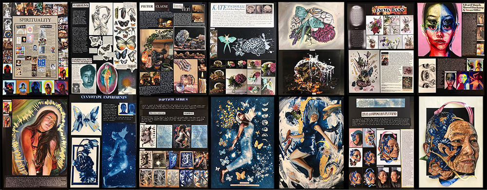

## Outline

- **Due:** Friday 22 November 11:59 pm
- **Mark weighting:** 40%
- **Theme:** [Other Minds](#theme)
- **Exhibition details**: [see below](#yr11-final-exhibition-details)
- **Specification:** [read the specs](#specification)
- **Template:** [template in gitlab]()
- **Submission:** submit your assignment according to the [instructions below](#submission-process)
- **Policies:** for late policies, academic integrity policies, etc. see the [policies page](/policies/)
- **Marking Criteria:** [Criteria](#marking) and [Rubric](#rubric)
- **FAQ:** [Fervently Anticipated Questions](#faq)

## Theme {#theme}

The project theme for your Final Project is **Other Minds**. This theme is inspired by the book [**_"Other Minds: The Octopus, the Sea, and the Deep Origins of Consciousness"_**](https://www.harpercollins.com.au/9780008226299/other-minds/) by [Peter Godfrey-Smith](https://en.wikipedia.org/wiki/Peter_Godfrey-Smith).

You are not expected to make a work about Octopuses! You are expected to engage with ideas that all living beings have minds &mdash; minds which are different to yours.

It is about cognition, consciousness, free will, intelligence, agency (to act) and autonomy (to act). It is especially about cognitive complexity of beings other than yourself. It is about seeing the world through different eyes, ears, and unimaginable sense organs.

This can possibly link to, and build upon, your Mini Project &mdash; as an extension, branching, or re-imagining of the thematic concept: "More Than Human".

<div id="yr11-final-exhibition-details" class="warn-box" markdown="1">

## Creative Computing Final Exhibition {#yr11-final-exhibition-details}

The final exhibition will be held Wednesday 11 December at the [Birch Building](https://maps.app.goo.gl/CjqF68WcVc3bUFi59), Innovation Space, Level 2, from 5pm to 7pm. All students are required to attend (as this occurs during regular scheduled class time).

The details are:

- **Time**: 5:00pm - 7:00pm
- **Date**: Wednesday 11 December
- **Location**: [Birch Building](https://www.anu.edu.au/maps?search=Birch), Innovation Space, Level 2

The exhibition will run from 5-7pm. Feel free to invite your friends and parents if you'd like! We will order some pizza's just for the class members before the exhibition starts (around 4:30pm) to celebrate your hard work.

### The Setup

We will have a couple of computers (at least 2) setup in the exhibition space, so no need to bring your own computers along. You'll be able to interact with any of your classmates' artefacts through any of these computers, so there wont be 'installations' which only exhibit a single person's work. We'll have a main screen set up in the exhibition space. We'll also have a number of stations set up for students to give a live performance or demo of their project artefact.

If you have any questions, [email Matthew](mailto:matthew.phillipps@anu.edu.au).

</div>
  
## Description

The end of the school year is approaching, and so is the EXTN1019 final project.
As we've foreshadowed all along in this course, your final project deliverable
is an interactive creative code artefact for an end-of-year creative code
exhibition.

Your goal is to provide an **engaging** performance/user experience of 2-3 minutes, but the exact nature of that creative code experience is up to
you.

## Specification {#specification}

Your final project submission has three parts:

- an interactive creative code artefact (your code)
- a `README.md` file explaining how to interact with your work
- a [**portfolio**](#portfolio) discussing the evolution of your project and your design decisions
- a `references.md` file with a list of works and influences you need to cite.

### Creative code artefact

Your creative code artefact needs to:

- run smoothly in a [web browser](/resources/02-software-setup/#firefox)
- be interactive (either by you, if you plan to perform with your artefact,
  or by others)
- produce some sort of creative output (visuals, sound, visuals+sound, etc.)

You will develop your work to align with the exhibition theme **"Other Minds"** - your work will represent your interpretation of the theme. If you're unsure about your ideas for
whatever reason, then feel free to ask a question either in class or on Teams. You may build upon - that is significantly enhance or extend, your Mini Project work which was based on the theme **"More Than Human"**.

### Portfolio {#portfolio}

The creative code artefact you submit for your final project is a function of
the decisions you make as you develop the artefact. Your portfolio should give us a window into the evolution of your artefact. We are not imposing a
strict structure for the portfolio &mdash; you can get creative with how you present it &mdash; but we will give you a few guidelines
to follow. Submit your portfolio as a `.pdf` file: if you have video or audio - include links to these resources in your pdf. **DO NOT INCLUDE VIDEO FILES IN YOUR REPOSITORY**.

- Early in your portfolio, you should introduce us to your interpretation of the _theme_ **"Other Minds"** and your user experience goals.

- You should discuss the key decisions you made while refining your
  artefact &mdash; including screenshots, screen-recordings and sketches of your project at various stages.

## Submission process {#submission-process}

You must submit all the necessary files (code, image files,
portfolio, references) by **committing and pushing them to GitLab by 11:59pm Friday 22 November**. The portfolio should be added to your project repository (the root folder, not any of the sub folders) as a `.pdf`, `.md`, `.js`, `.html` file. You must push it to _your fork_ of the [final project
template]().

You must ALSO submit to the Wattle assignment "Final Project". This will record your submission time and enable marking of the assignment. You should submit a link to your gitlab repository.

**Due to assessment timelines extensions beyond this date will only be granted in extenuating circumstances with comprehensive documentation**

## Marking criteria {#marking}

The marking criteria are connected to the [course learning outcomes (LOs)](/outline/#learning-outcomes-a), and you will be assessed on your project's

### Interaction design (connected to LO #1 & #4)

- Do your interactions enhance the communication of your interpretation of the theme?

- Have you meaningfully designed your interactions with your user experience goals in mind?

### Artistic output (LO #2, #3 and #4)

- Does the visual aesthetic (animations, colour, composition, texture) enhance the communication of your interpretation of the theme? **OR** Does your choice of sonic output (rhythm, timbre, effects, pitch, dynamics) enhance the communication of your interpretation of the theme?

- Have you meaningfully designed your visual aesthetic **OR** sonic output with your user experience goals in mind?

### Implementation (LO #2 and #3)

- Have you selected computing concepts appropriately to implement your ideas in code?

- Does your code work as expected? Are there any obvious bugs/janky bits?

## Final Project Assessment Rubric {#rubric}

|                                                                           | A Grade<br>(9-10)                                                                                                                                                                                                                                 | B Grade<br>(7-8)                                                                                                                                                                                                                    | C Grade<br>(5-6)                                                                                                                                                                       | D Grade<br>(3-4)                                                                                                                   | E Grade<br>(0-2)                                                                                                                                                |
| :------------------------------------------------------------------------ | :------------------------------------------------------------------------------------------------------------------------------------------------------------------------------------------------------------------------------------------------ | :---------------------------------------------------------------------------------------------------------------------------------------------------------------------------------------------------------------------------------- | :------------------------------------------------------------------------------------------------------------------------------------------------------------------------------------- | :--------------------------------------------------------------------------------------------------------------------------------- | :-------------------------------------------------------------------------------------------------------------------------------------------------------------- |
| **Interaction Design**<br>**LO #1**<br> **30%**                           |                                                                                                                                                                                                                                                   |                                                                                                                                                                                                                                     |                                                                                                                                                                                        |                                                                                                                                    |                                                                                                                                                                 |
| Interaction Design Effectiveness<br>_10 Marks_                            | strong and effective interaction, innovative and/or surprising and/or highly engaging. It genuinely deepens the user experience                                                                                                                   | interaction is well demonstrated, well designed, and well implemented                                                                                                                                                               | satisfactory interaction, but interactivity lacks depth/sophistication                                                                                                                 | limited interaction, demonstration does not identify scope and purpose of affordances                                              | very limited user interaction (or lack of demonstration)                                                                                                        |
| Interaction Connection to the Theme<br> _10 Marks_                        | The interactions deeply and strongly enhance the communication of your interpretation of the theme                                                                                                                                                | The interactions enhance the communication of your interpretation of the theme                                                                                                                                                      | The interactions are connected to your interpretation of the theme                                                                                                                     | The interactions may align with an interpretation of the theme                                                                     | The interactions are disconnected from the theme                                                                                                                |
| Meaningful Interaction<br>_10 Marks_                                      | The interactions are meaningfully designed for an optimal user experience, aligning with your identified, sophisticated, user experience goals                                                                                                    | The interactions are designed for an engaging user experience, aligning with your identified user experience goals                                                                                                                  | The interactions enable a satisfying user experience which aligns with some user experience goals                                                                                      | The implemented interactions provide a limited user experience which are not aligned with user experience goals                    | Very limited or no interactions                                                                                                                                 |
| **Artistic Output**<br>**LO #2, #3 and #4**<br>**30%**                    |                                                                                                                                                                                                                                                   |                                                                                                                                                                                                                                     |                                                                                                                                                                                        |                                                                                                                                    |                                                                                                                                                                 |
| Artistic Aesthetics<br>_10 Marks_                                         | Outputs demonstrate deep and critical engagement with aesthetics, communicating with purpose, generating strong user engagement                                                                                                                   | Outputs show a degree of depth and variation which maintains engagement                                                                                                                                                             | Artefacts generated show a sound understanding of aesthetics, but may contain implementation issues.                                                                                   | Limited output, or output derived from existing work with VERY MINOR alterations                                                   | Very limited output which demonstrate very limited understanding of aesthetics                                                                                  |
| Connection between Design and Theme<br>_10 Marks_                         | Artistic artefacts/audio strongly enhance the communication of your interpretation of the theme                                                                                                                                                   | Artistic artefacts/audio enhance the communication of the theme                                                                                                                                                                     | Artistic artefacts/audio are somewhat aligned with the theme                                                                                                                           | Artistic artefacts/audio are peripherally associated with the theme                                                                | Artistic artefacts/audio are unrelated to the theme                                                                                                             |
| Connection between Design and User Experience Goals<br>_10 Marks_         | The design of the artistic/audio output deeply and meaningfully connects with the identified user experience goals                                                                                                                                | The design of the artistic/audio output meaningfully connects with user experience goals                                                                                                                                            | The artistic/audio outputs are somewhat aligned with user experience goals                                                                                                             | The artistic/audio output show little relationship to any user experience goals                                                    | Very limited artistic /audio outputs with no association with user experience goals                                                                             |
| **Implementation**<br>**LO #2 and #3**<br>**20%**                         |                                                                                                                                                                                                                                                   |                                                                                                                                                                                                                                     |                                                                                                                                                                                        |                                                                                                                                    |                                                                                                                                                                 |
| Use of Computing Concepts<br>_10 Marks_                                   | Your selected and original computing/code concepts all contribute effectively and efficiently to the implementation of your ideas                                                                                                                 | Your selected computing/code concepts (mostly original) contribute (almost always) effectively to the implementation of your ideas                                                                                                  | Your selected computing/code concepts have been mostly borrowed from elsewhere to implement your ideas                                                                                 | Your selection of computing concepts has been limited and are do not work effectively to implement your ideas                      | Selected computing concepts demonstrate a very limited understanding                                                                                            |
| Coding Effectiveness<br>_10 Marks_                                        | employs critical and creative thinking, drawing on data and information to solve complex problems effectively: the polished and well-documented code works as intended                                                                            | employs critical OR creative thinking, drawing on data and information to solve problems effectively: the code works effectively in most cases                                                                                      | employs critical thinking, drawing on data and information to solve problems: the code works satisfactorily, but contains minor flaws                                                  | draws on some on information in an attempt to solve problems: the code exhibits major flaws                                        | the code doesn't work                                                                                                                                           |
| <a name="rubric-portfolio" />**Portfolio**<br>**LO #1 and #4**<br>**20%** |                                                                                                                                                                                                                                                   |                                                                                                                                                                                                                                     |                                                                                                                                                                                        |                                                                                                                                    |                                                                                                                                                                 |
| Discussion of design decisions<br>_5 Marks_                               | Discussion communicates effectively and concisely, and with a high degree of insight and analysis about the design decisions, compromises, adaptations, alternatives and/or synchronicity used in the design process                              | Discussion employs critical analysis into the design decisions made in the design process                                                                                                                                           | Discussion employs some analytical techniques into the design decisions made                                                                                                           | Discussion lists design decisions made without reflection or analysis                                                              | Very limited or no discussion of design decisions                                                                                                               |
| Layout/Content<br>_5 Marks_                                               | Portfolio layout and curation creatively and effectively communicates the project development process and your journey into creative computing that lead to this point                                                                            | Portfolio layout and curation effectively communicates the project development process and/or your journey into creative computing that lead to this point with a degree of creativity                                              | Portfolio layout and curation illustrates the project development process with limited creativity                                                                                      | Portfolio layout and curation is limited and covers parts of the learning journey or the development process, but lacks creativity | Portfolio curation and layout are very limited, lack creativity, or do not cover the development process nor the learning journey                               |
| Reflection<br>_5 Marks_                                                   | Your portfolio incorporates deep reflections into how the decisions you made drive and deliver your user experience goals and how your reflections helped you change and adapt your work to meet the goals/communicate the theme                  | Your portfolio incorporates strong reflections into how the decisions you made serve your user experience goals and how your reflections helped you change your work to meet the goals                                              | Your portfolio incorporates some reflections into how the decisions you made align with your user experience goals                                                                     | Your portfolio includes limited reflections about the decisions you made                                                           | Your portfolio lacks reflections                                                                                                                                |
| References<br>_5 Marks_<br>[FAQ on referencing](#referencing)             | References are comprehensive, including code, artworks, research, and influences using the [ACM reference style](https://www.acm.org/publications/authors/reference-formatting) or using [gitlab referencing](#gitlab-referencing) as shown below | References are mostly comprehensive, but may miss some influences, using the [ACM reference style](https://www.acm.org/publications/authors/reference-formatting) or using [gitlab referencing](#gitlab-referencing) as shown below | References are either comprehensive but do not use appropriate ACM/ANU styles - or a mix of styles, OR they miss a significant number of works used and the ACM or ANU academic styles | References are very limited (links to URLs for some works)                                                                         | References are missing. NOTE: it is expected that you reference ideas and sources from artistic influences, interaction designs, code examples, tutorials, etc. |

## FAQ {#faq}

### What's with the **interactive** part?

You've been making interactive creative code artefacts pretty much the whole
time in this course. Any p5 sketch which uses a `mouseX` or a `mouseY` or has a
`keyPressed()` or `mousePressed()` callback (or anything along those lines) is
interactive, because the behaviour changes in response to the input of the
viewer. Same with the Tone.js stuff &mdash; all the "hit space to play" stuff makes it
an interactive work.

Now, since _interaction_ is one of the marking criteria, you probably want to
put a bit more thought into it than just e.g. "hit space to play". You should investigate different forms of human-computer interaction and how affordances are designed and implemented to engage, and affect audiences/users. How can your interaction contribute to the way an audience feels/responds?

One other thing: making your final project interactive doesn't necessarily mean
it has to be able to be used by just anyone with no training &mdash; it's ok if you
make an interactive performance interface just for you.

### Do I get a mark for the portfolio?

Yes: see the [rubric section "Portfolio" above](#rubric-portfolio). The portfolio will help us better understand your process and final product when we mark it. We will be looking at your design decisions, content curation and creativity of layout, reflections on the design process and learning journey, and referencing.

### What type of file should the portfolio be?

The portfolio should be

- a new PDF file in your project folder called `fp-portfolio.pdf`

If you want to make your portfolio in a Google slide deck, you can submit a `fp-portfolio.pdf` which holds a link to the slide deck.

If you want to submit a video or audio file you can submit a `fp-portfolio.pdf` which holds a link to the slide deck.

However you create the file, make sure you add, commit & push it to GitLab &mdash; because otherwise it's not part of your submission.

### What sort of "design decisions" should I discuss in my portfolio?

Here are some ideas.

- Did you have an ideas which you found challenging to implement in code? How did you overcome this and what compromises did you make? What did you prioritise?

- The implementation of an idea. The "breathing circle" exercise from Week 3 taught us that there is more than one way to implement an idea. Why did you decide to implement an idea a certain way and did you explore alternatives?

- Were there any "happy accidents" which you decided to keep or explore further?

Keep the descriptions of your decisions as brief as possible; we care more about why you made those decisions and how it relates to your user experience goals.

### What should the layout of my portfolio look like?

You can get creative with the layout of your portfolio, as long as it's readable (if submitting a pdf) or audible (if submitting a video).

See the example below for some inspiration. This is a year 12/13 painting
coursework portfolio from Amanda Zheng &mdash; a highschool painting student from New
Zealand. The portfolio documents their exploration of a theme. A discussion of their work can be found
[here](https://www.studentartguide.com/featured/top-in-new-zealand-2021-a-level-art).



### Can I use some of the information I used in my Mini Project when explaining my project in the portfolio?

The portfolio is not meant to
be a description of the project. It should showcase the evolution of your final project. You will also need to _reflect_ on how the decisions you make serve your user experience goals and write/talk about this in your portfolio. You may include significant influences / lessons learned from Creative Computing this year &mdash; including lessons learned from your Mini Project.

### What will we be doing in class for the final weeks leading up to the final project submission deadline?

Class is still on as normal including
Wednesday Nov 20. There might be some "content" to work through in the class, but
it'll mostly be about supporting you to develop, test and _iteratively refine_
your final project and exhibition presentation.

You need to make the most of these remaining class sessions! That means:

- working hard outside of class until you get stuck, and then bringing your
  problem to class (although you can also post questions in the main [Teams
  channel]({{site.teams_url_2024}})) at any time, as per the [class communication
  policy](/policies/#communication)

- taking the time after a class to finish off any work you didn't get done, and
  to ask any followup questions if you get stuck
- talking to your classmates (either on the general Teams channel, or you can even DM them)
  to see how they're going, ask for advice, get feedback on your work in
  progress, etc.

### Will the final exhibition be in-person, or online? {#will-the-final-exhibition-be-in-person-or-online}

**Yes, it will be in person**

### Do I have to demonstrate my work _live_ at the exhibition?

No, you don't _have_ to. If you are working on a sound/music artefact, you might prefer to submit your portfolio as a video, but it's not a must. This time you're primarily submitting the code artefact itself. That means your code really needs to work &mdash; and not only on your laptop.

Don't fret, though, because we'll be exploring ways to make sure that it works
reliably in the last few weeks of class, but the key is going to be checking
things at the "test URL".

### What's the relationship between [the Mini Project](/deliverables-year-11/02-mini-project/) and this final project?

This is the big one &mdash; it's meant to be a standalone work of interactive creative
code, with a degree of depth and polish that's beyond what you did for your
Mini Project or for your blog posts.

### Can I use code that I've already committed & pushed to GitLab as part of one of my labs? {#gitlab-referencing}

Yep, that's fine &mdash; if it's your code, you don't even have to
[reference](#referencing) it. If it's code from the template itself, then make
sure you make a note of it. As an example, if you copy the `Pianoetta` class from the lab 13 (Sequences)
template you should say something like this in your `references.md` file:

```markdown
The `Pianoetta` class (starting at line 130 of my
`audio-sketch.js` file) is taken from the [lab 13 template repo](https://gitlab.cecs.anu.edu.au/extn1019/2023-2024/year-11/extn1019-2023-lab-13).
```

### Can I use code from elsewhere on the internet (e.g. p5js.org, coding train, GitHub)? {#referencing}

Yep &mdash; using/remixing other people's creative code is common practice in creative computing. However, there are two things
to be a bit careful about when doing so:

- you need to reference **everything** in your `references.md` file (seriously,
  do it as-you-go rather than waiting till the end, because "whoops, I forgot to
  add the reference" isn't an acceptable excuse)

- it's ok to use these external sources, but your final project **must contain
  significant new work by you** &mdash; you can't just cobble together stuff from
  these other places and pass it off as your own
- see [above for an example of how to reference code from the GitLab labs covered during the year](#gitlab-referencing)
- For other works cited by you, the preference would be to use [ACM reference style](https://www.acm.org/publications/authors/reference-formatting) for in-text citations in your portfolio. You should use in-text citation in your portfolio, and have your complete bibliography in `references.md`. To be clear, references in text should be shown as a number in square brackets: `[1]`, with a matching entry in your `references.md` file. [This resource](https://v4.chriskrycho.com/2015/academic-markdown-and-citations.html) may be useful for formatting your bibliography in Markdown.

### If I find a bug between the submission date and the exhibition, can I fix it?

Yep &mdash; the "push to GitLab -> show up on the test URL a couple of minutes later" thing will work all the way up to the exhibition time. As [described
above](#submission-process), though, your last push before the deadline is still counted
(and marked) as your submission.
