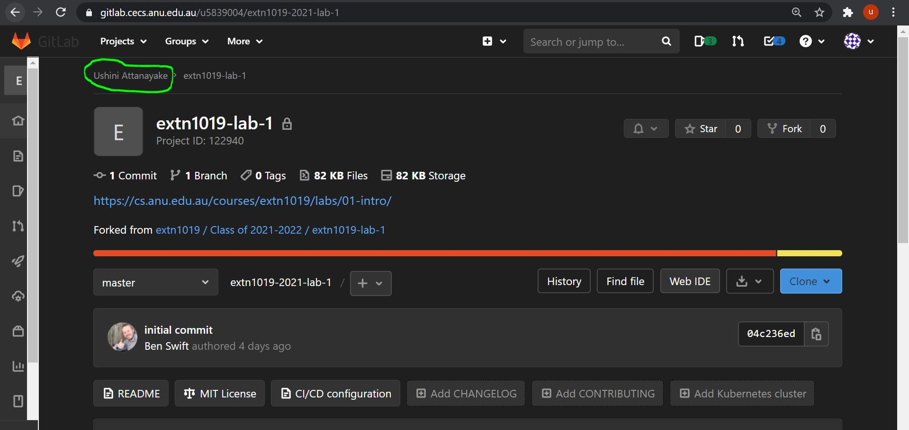
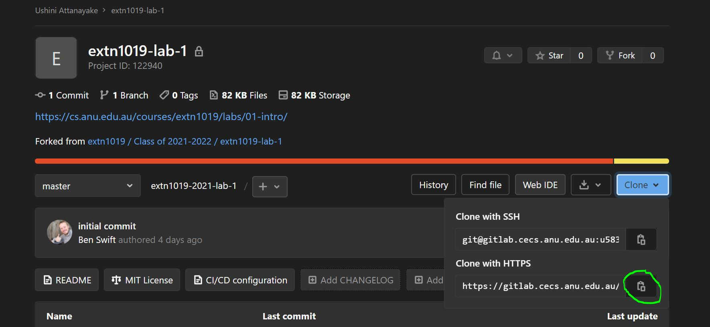
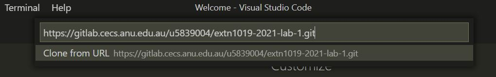
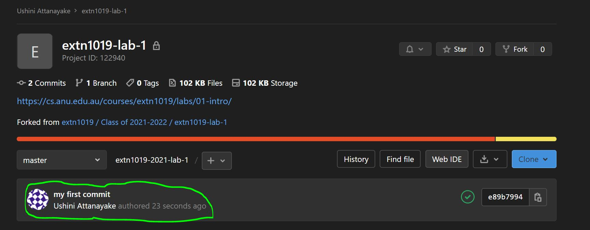
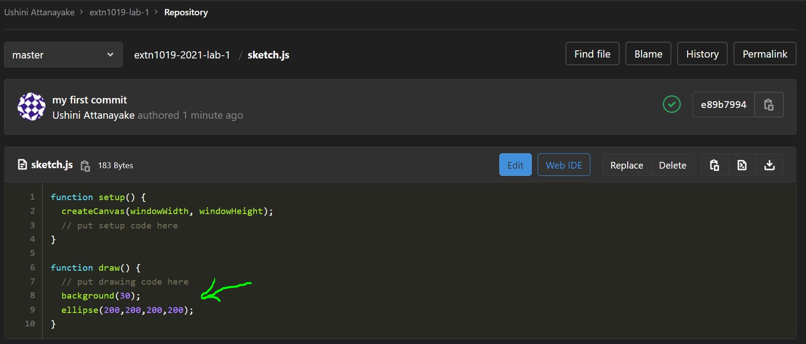

## Outline

In this lab you will:

1. meet the tools you'll need in this course:
   - the [VSCode](https://code.visualstudio.com/) (or
     [VSCodium](https://vscodium.com) if you're on one of [the ANU lab
     machines](/resources/02-software-setup/)) text
     editor you'll use to write the code
   - [Microsoft Teams](), the chat and video meeting platform we will be using for labs and lectures.

2. go through the steps you'll need to submit all assignments in this course (so
   it's really important you can do them now---don't leave this stuff till the
   last minute)

3. **put a circle on the internet** (eew)

## Hello and Welcome! 

Hello and welcome to ANU Extension Creative Computing! We are all very excited
to have you in our class and we hope you are too. You might have a few questions
and unsure of what to expect. That is okay! We shall explain in this class and
throughout the course.

We are going to start with a short activity (15 minutes).

Turn to the person next to you. Introduce yourself. Discuss the following questions:
- what artist have you been into recently? (Artist is not limited to visual
  artist, any musical, dance, video maker, etc counts too!)
- what is unique about their art? 

Wait---isn't this a coding course? Why are we asking about artist? Well, this is
a coding course but its also an art course so its good to think of different
artists for inspiration. Also you might hear about a cool new artist.

We (the tutors) will come round and have brief chat.

:::tip
Introduce your partner. Briefly explain what artist your partner has been interested in and why.
:::

## Introduction: a pre-lab

Lab 1 is a bit of a weird lab---it's more like a *pre-lab* before the normal lab
material starts in week 2. You can work through it at any time, either on campus
or at home (or wherever). If you get through it ok (and can show a circle in
your browser) then you're ready to start the course. **If you get stuck that's
ok**: you can ask questions on the EXTN1019 teams channel, which you can join
with [this link]().

If you're really familiar with this stuff, there's a [tl;dr](#tldr) version at
the end. Again, though, I want to emphasise that it's ok if this is all
new---you'll get plenty of support in this course to get the hang of it. All we
ask is that you put in the effort.

## Part 1: software setup {#software-setup}

In this course you'll write code using the [VSCode text editor](/resources/02-software-setup/#vscode), run the code in the [Firefox](/resources/02-software-setup/#firefox) web browser, and
download/view/submit your lab & assignment code with [git](/resources/02-software-setup/#git). You'll also use [Microsoft
Teams]() to post questions, have discussions and hang out with
other students.

There's a separate page dedicated to software setup, so if you're on your own
laptop you should head to the [software setup page](/resources/02-software-setup/) and follow the instructions.

:::warning
Even if you're familiar with the software setup, you'll still need to have
logged in to all the various ANU systems as described in the [course start
checklist in the FAQ](/resources/01-faq/#course-start-checklist),
so make sure you get that done ASAP.
:::

If want to work on the lab content outside of the workshop hours, we advise you
to install the software on your laptop. Otherwise, all of the software is
already installed on the lab machines at the ANU.

[^extension-install]:
    If you're on your own machine or on a lab machine, you'll only have to do
    this once---after that they'll be saved to your home directory and will be
    automatically detected when you log back in. Some on campus lab machines,
    need you to install the EXTN1019 extension each time you log in (a pain, but
    it only takes a second).

## Part 2: forking the [lab 1 template]()  {#forking}

:::info
From here, we'll use a few git-specific terms, and in general we'll explain
everything along the way. If you're confused, though, there's a section on git
help on the [software setup page](/resources/02-software-setup/#git).
:::

Once you've got the software you need, you have to log in to the GitLab server
at using your normal ANU credentials (uni ID and password) and bring up the [lab
1 repository](). A **repository** (often abbreviated to
"repo") is basically just a box which stores a bunch of files and their history
(the changes they've been through over time). Whenever you hear the word
repo/repository, think "a directory of files which Git is keeping track of".

:::tip
If you like, you can add [SSH
keys](https://gitlab.cecs.anu.edu.au/help/ssh/README.md#adding-an-ssh-key-to-your-gitlab-account)
to your account so that you don't have to type in your uni ID and password every
time, but it's not essential and you can also add that stuff later. If you're
new to all this git stuff, it's probably ok to just stick with the ID & password
for now.
:::

This template is a starting point for everyone who wants to complete this lab,
so before _you_ can start working on it you need to create your own "copy". This
is called **forking**, and creates a new repo (your "fork").

To fork the [lab 1 template]({{page.template_repo}}), click the fork button on
the GitLab page in your web browser (I've circled it in red).

Once you've done that, you should see a page like the one below---you now have
your **own** fork (copy) of these files on the server, as indicated that it
shows your name in the top-left-hand corner (circled in green). The files are
exactly the same, but the repo is now attached to *your* GitLab account, rather
than the `extn1019/2024-2025` GitLab account, so you can change the files and push
things up to the GitLab server without messing up anyone else's starting point.



## Part 3: cloning the lab 1 template {#cloning}

Your fork of the template repo is still on the GitLab server, though. To
actually work on these files, you need to **clone** (download) this repo to the
computer you're working on.

1. In VSCode, open the *command palette* (*View > Command Palette*, or
   <kbd>ctrl</kbd>+<kbd>shift</kbd>+<kbd>P</kbd>) and a prompt will appear in
   the top.

2. Type `git clone` and hit enter. A box will appear asking for the repo url.

3. Back on gitlab, open your fork of the lab code. Directly under the page title
   there's a box that looks like this (if it **doesn't** say `HTTPS` on the left
   hand side, click that box and select it. Now click on the right hand side box
   to copy the URL to your clipboard.)

   

4. Back in VSCode, paste the url into the prompt box and hit enter --- making sure that the "Clone from URL" option is highlighted.

   

5. A window will open asking you where to save the files. If this is your own
   computer it might be a good idea to create a `extn1019` folder and clone all
   your repositories there. If this is a lab computer, make sure you save this
   to your university homedrive (it'll be called `u1234567`). When you've found
   a good spot for you files hit *Enter* or click "Select Repository Location".

5. Now you'll be asked to enter your username and password. This will be the
   same uid and password you used to log into GitLab.

7. If you entered your uid and password correctly, a popup will appear in the
   bottom right of VSCode asking you to `Open Repository` or `Add to Workspace`.
   Today we're going to choose `Open Repository`, but they have a similar
   effect.

Great job! Now lets make that circle.

## Part 4: making a circle {#running}

Now you've got the template files in VSCode you can get to work.

In the sidebar on the left you can see all the files in the template folder.
Throughout the course we'll explain what each of these files is for but for now
the one we care about is `sketch.js`. Click on that one and VSCode will open it
up and look something like this

You're getting close to creating the circle you've been thinking about all
along. In the `draw` function (immediately below `// your "draw loop" code goes
here`) add the following lines:

``` javascript
background(30);
ellipse(200,200,200,200);
```

Now save the file.

The final piece of the puzzle is to run/view the sketch. To do this, you need to
start the live server:

:::info
We are working to get the live server ready for use by the first workshop. So if you're accessing this content before the workshop, it might not be ready for you.
:::

1. Open the command palette (*View > Command Palette*)
2. Type "Open with live server"
3. Hit *Enter*

Your default browser will open up and should show a white circle on a charcoal
background.

:::info
As stated on the [software setup page](/resources/02-software-setup/#firefox) you should use Firefox 
as your web browser for the course, and (for convenience) you could set it to be
your default browser (since that's what the live server extension will open the
sketch in).
:::

It might not look like much, but you've made your first p5 sketch, and you
should take a moment to enjoy your success.


## Part 5: committing & pushing the changes {#committing}

Now that you've successfully completed today's task of putting a circle on the
internet it's important that you save your work and push it up to GitLab. This
process is important to learn because it's the way you'll submit all your
assignments for this course!

The first thing to do is save your `sketch.js` the usual way (i.e. *File > Save*
or *Ctrl-S*/*Cmd-S* depending on your OS).

Now you want to upload your changes to the `sketch.js` file back to gitlab so
it's safe and sound. This involves some more VSCode commands so open up the
command palette using *View > Command Palette*.

Type in `git commit all` and press enter. You'll get a popup which says "There
are no staged changes to commit. Would you like to automatically stage all your
changes and commit them directly?". Click `yes`.

Now you'll see a popup asking for a "Commit Message". Write a note about the
changes you made (e.g. "I added a circle to the sketch"). This message is just
so you can remember what this change was so write whatever makes sense to you.

In Git's terminology, a **commit** is a snapshot of your code at a particular
time that you can always return to. This means that if you break your code
somehow you can always feel safe knowing you can just return to your last commit
where everything was working. When working on assignments you'll want to commit
your code regularly just to be safe.

Now all you have to do is push (upload) these committed changes to GitLab with
the **push** command. Open up the command palette using *View > Command
Palette*, type `git push` and hit *Enter*. You might need to put your UID &
password in again at the push step. If you get an unauthorised message, try once
more and if it still doesn't work seek help from a tutor or friend.

If everything worked successfully, then when you refresh the GitLab project page
for your fork (i.e.
`https://gitlab.cecs.anu.edu.au/uXXXXXXX/extn1019-2024-year-11-lab-1.git`, where `uXXXXXXX` should be replaced with your UID) you should see
the first line of that commit message as shown:



And if you click on the `sketch.js` filename further down you should see the new
version with your `ellipse` line in there. Hooray!



## Part 6: putting your circle on the internet {#pushing}

It might have felt like your sketch was already on the internet when you were
building it before because it was in your browser, but really it was only
visible to you. By pushing your code to gitlab, your page was automatically
published online **within the ANU network**.

If you're on ANU campus wifi or ethernet right now you can check this worked by
copying and pasting this link into your browser and replace `uXXXXXXX` with your
university ID.

:::info
This link might not be accessible before the first workshop. 
:::

`https://extn1019.cecs.anu.edu.au/uXXXXXXX/extn1019-2024-year-11-lab-1/`

If you can see your circle, great job, you're done!

If you happen to be away from campus right now, you'll need to use the [ANU's
reverse proxy login](https://login.virtual.anu.edu.au/login). This allows you to
access ANU resources (like the library) from outside campus. Use your anu id and
password to log in. Then paste the URL above (with your university id swapped
in) and click `go`.

If you can see your circle, great job, you're done!

It's good to get in the habit of checking the published version of your sketch
every week because this is what your tutor will see when they mark your
assignments.

## Part 7: the short version {#tldr}

Here's the [tl;dr](https://en.wikipedia.org/wiki/TL%3BDR) version (if you've
done this version control thing before, or if you're just after a refresher):

1. the [lab 1 template]() starts in a
   `extn1019-2024-year-11-lab-1` Git repo on the [CECS GitLab server]({{
   page.template_repo }})

2. to work on the sketch, fork the [template repo]() to
   **your own GitLab account**

3. clone **your fork**[^own-fork] to the computer you want to work on

4. open the folder in VSCode and start the p5 live server (`File > Command
   Palette` type `Open with live server` and hit *Enter*)

6. to submit your work, commit and push the changes to your fork (you can do
   this as many times as you like)

[^own-fork]:
    make sure you clone **your own fork** (i.e. the one with your uni ID in the
    url) to your local machine, not the template (because obviously you aren't
    able to change the template for everyone---GitLab won't let you)

## Summary

Congratulations! In this pre-lab you learned how to use the tools you'll need to
participate in the course. If you feel like you just typed in a bunch of things
and didn't really understand what went on, then that's ok---we'll explain
**everything** during the course. But it's important that you at least check that
everything works for you, because if it doesn't then you'll have problems later
on.

See you in the next workshop :)
