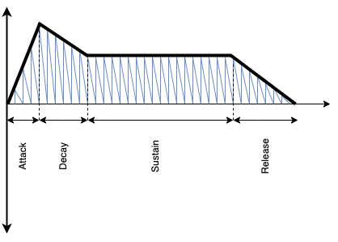
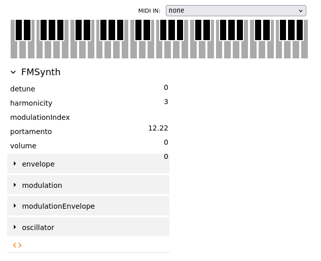
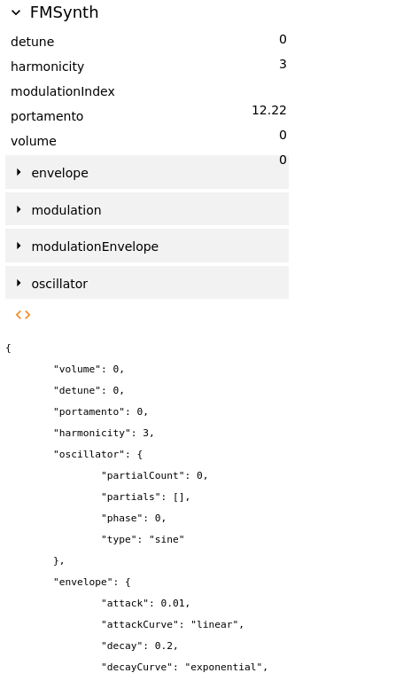
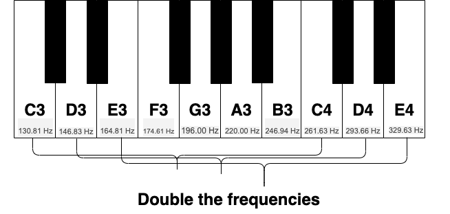
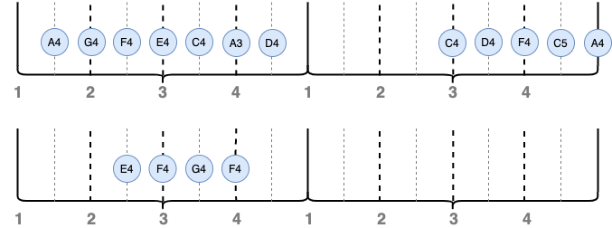

## Outline

In this lab you will:

1. Explore the various synths of Tone.js
2. Get a brief intro to some music theory
3. Re-create a phrase from a song using loops and arrays of notes
4. Look at how objects are constructed

## Introduction

Hello hello and welcome back to a whacky, zany computer music lab folks! The lab does not need much of an introduction. We are graduating from drone sounds to note-level music today. That's right we're making melodies and potentially some beats too! You know the drill. Fork and clone those repos!

**do:** To get started, fork and then clone the [lab 12 template
repo](), open it in VSCode and start the live server.

## Part 1: Synthesizers

Throughout the lab, we will be using synthesizers as our primary instrument for melody making. We could dedicate a whole lab to synthesizers alone, but the short version is, a synthesizer is one or several oscillators. Unlike oscillators which sustain a single frequency ad infinitum, synthesizers allow us to 1) modulate the frequency in a specific way to start and stop notes and 2) change the frequency of each note we play. This allows us to play distinct frequencies at a note level.

The amplitude of the oscillator in a synth is modulated using something called an [_ADSR envelope_](https://github.com/Tonejs/Tone.js/wiki/Envelope). ADSR stands for Attack, Decay, Sustain, Release. The ADSR envelope has four distinct parts. The `Attack` section raises the amplitude from zero to some maximum value, this is immediately followed by a `Decay` section which reduces the amplitude to some value. The `Sustain` section keeps the amplitude constant for a certain amount of time and the `Release` section brings the amplitude back to zero over a certain amount of time. Usually these changes in amplitude in the `Attack`, `Decay` and `Release` sections are _linear_, but can also be [_exponential_, _cosine_, _sine_, _step_, _ripple_, and _bounce_](https://github.com/Tonejs/Tone.js/wiki/Envelope#curves).



You'll notice that we have already created a synthesizer in your template repo for this week. Synthesizer (and other instruments like oscillators) are represented as a special type of data in Tone.js called _Objects_. Just like other types of data such as Numbers `4.3` and Strings `"Hello world!"`, we can assign Objects like synthesizers to a variable. In the example below, we create a variable called `synth` and assign it to a synthesizer object which has a sine wave oscillator under the hood. Objects are just a bit more complex than Numbers and Strings. We'll cover _Objects_ in more detail in coming weeks.

As a sneak preview, you can see how to create an object (Class Pianoetta) with properties (instrument), methods (deep_dispose), and class properties (static synthJSON) at the bottom of the template.

```js
let synth;
synth = new Tone.Synth("sine");
```

Each synth has an ADSR envelope. In Tone.js you have control over the duration of each section in the ADSR envelope. We can use the `.` operator on our synth's envelope `synth.envelope` to access and update the duration of each section. Here the duration is represented in seconds.

```js
// sets the decay duration of the synth's 
// ADSR envelope to 0.8 seconds
synth.envelope.decay = 0.8;
```

To trigger a complete envelope on our synth, we call `triggerAttackRelease()` on our synth object. The synth is currently being triggered each time the mouse is pressed. You can see `triggerAttackRelease()` being called within the `mousePressed()` function in your template.

```js
// trigger envelope which is sustained for 0.5 seconds
// give the synth's oscillator a frequency of 440Hz
synth.triggerAttackRelease("440Hz", 0.5);
```

Alternatively you can trigger the attack and release separately, which enables you to interact with your instrument in a sustained way (pun intended :-). You can see this in mousePressed() and mouseReleased().

```js
  synth.triggerAttack("440Hz", Tone.now(), 0.8);
```

```js
  synth.triggerRelease();
```

**do:** Following the example above, change the durations of each section in the ADSR envelope defined in *synthJSON* and observe the effects on the _timbre_ you hear. You can also head over to the [synthesizers](https://tonejs.github.io/docs/r13/Synth) reference page in Tone.js. You'll find an assortment of different synths on the left hand side panel under "Instrument". Try creating a few new synths using the reference. You can modify Pianoetta, or copy it to create your own.

**do:** A good way to design your own synthesizer is to start with the [Tone.js examples](https://tonejs.github.io/examples/). After choosing a Synth type, you can modify the parameters to create unique sounds that you enjoy. Once you are happy with a sound, you can click the **`"<>"`** link to show the JavaScript required to create the object.



After clicking **`<>`**:



You can copy the code to build your own synth (in the same way as the Pianoetta synth).

## Part 2: Sequences

In this section we are going to be revisiting _repetition_ with `loops` and _collections_ of note data with `arrays`. Things are going to look a little different compared to p5.js, but some of the underlying principles are still the same. Before we start creating our own sequences with `loops` and `arrays`, we'll need to cover how time and notes are represented. So follow me on a slight digression...

### Representation of time and duration

...Time in Tone.js is managed by the _Transport_ object. We usually think of time in terms of milliseconds, seconds, minutes, hours etc. but in music, it's useful to think of `beats` as the unit of measurement associated with time. Much like a clock _ticks_ every second, the Transport object _ticks_ every beat. By default, the exact duration of a beat (if we were to represent it in seconds--a more traditional representation of time) is 1/2 a second. Alternatively, you can think of the Transport object ticking 120 beats per minute (bmp).

When you start the Transport object using `Tone.Transport.start()`, it starts ticking over beats at a rate of 120 beats per minute. The bpm is the `tempo` or the rate at which beats tick over. You can actually change the value of the tempo and this will have the effect of playing back notes at a faster or slower rate.

Some of this notation can be a bit confusing if you're new to `note values` and `bars`. In all honesty, a lot of musical representation is kind of arbitrary and different parts of the world work with different representations. You're welcome to explore other representations in your project work for this course if it piques your interest, but for this lesson, we will subscribe to the following representation of `note values`.

If 4 beats are to pass i.e. a count of `"1, 2, 3, 4"`, we call this collection of 4 beats _one measure_ or _one bar_. If we were to hold a note over the duration of an entire measure, that note would be considered a whole note -- the duration of a whole note is represented as `"1n"`. If a note is held for half a measure, it's called a half note and represented as `"2n"` in Tone.js. If a note is held for a quarter of an entire measure, it's called a quarter note and represented as `"4n"` in Tone.js. Quarter notes have the duration of one beat. Using this notation, you can subdivide a measure into any _even_ or _odd_ subdivision you like.

### Representation of pitches

With oscillators, we controlled the pitch of each oscillation by specifying the frequency of our oscillator. Let's say we start at a frequency of `440Hz` and we gradually move through all possible frequencies until we reach `880Hz`, then we repeat this process again until we reach `1760Hz`. What we'll find is that the nature of the sounds we hear as we move from `440Hz` to `880Hz` repeat themselves when we move from `880Hz` to `1760Hz`; they are just higher in pitch. If you've ever looked at a keyboard/piano and seen the structure of notes repeating themselves, well that's a direct consequence of this phenomena where our perception of the frequencies repeat themselves at higher pitches.

It just so happens that `440Hz` is the pitch of the note `A3`. In most Western music, if we start at `A3` and move through 12 notes (following a certain interval pattern of pitches), we return at another A note `A4` which still sounds like an A, but a bit higher. The number after the A tells you how high or low the A note is. `A4` has a frequency of `880Hz` and is an _octave_ higher than `A3`. I find this stuff much easier to comprehend if we pick a specific instrument and notate the pitches and note names on that instrument so check out this diagram of a keyboard notated with frequencies and note names.



Alrighty, that should hopefully give you enough music theory to get you started on creating your own sequences.

### Making sequences

We will be playing a sequence of notes using `Tone.Loop`. This is sort of similar to `for-loops` which we covered last term, only instead of iterating through the loop using an index like `i` i.e. `(i=0; i<200; i++)`, we iterate based on two values; 

1. the duration between iterations and 
2. the exact time at which a given iteration begins. 

We avoid using the variable name `loop`, as this is already taken by `p5.js` - that is why our Tone.loop is called `looper`. When we start the loop using `looper.start()`, the iterations immediately start...well...iterating. The example below is already in your template repo. When we create a `Tone.Loop` we have to specify a separate function `myLoop` which is where we do all the looping. You'll see in your template repo, the `myLoop` function is given a `time` value. This is like a variable which holds the time at which the current iteration occurs.

```js
let looper = new Tone.Loop(myLoop, "8n");
looper.start();
```

Add the following line of code inside the body of the `myLoop` function (between the curly brackets) in your template repo.

```js
// 'time' tells us exactly when to call triggerAttackRelease
// "16n" is the duration of the note
// 'C3' is the pitch
synth.triggerAttackRelease("C3", "16n", time);
```

:::tip
**talk:** How might you use _arrays_ to loop through the notes in a C major scale? The notes in a C major scale are `"C, D, E, F, G, A, B, C"`. _Hint:_ Your `myLoop` has an index which starts at zero and keeps incrementing by 1 with each iteration of the loop.
:::

**do:** Modify your code to loop through a C major scale! Hehe didn't **"C"**  that one coming, did you? Store the notes of your C major scale in an array called `notes`.

## Part 3: Make your own sequence

In this section we are going to follow an example to recreate a phrase from [Redbone](https://www.youtube.com/watch?v=ezbsbkqoRrs&ab_channel=ChildishGambinoVEVO) by Childish Gambino. If you're on top of the music theory stuff, feel free to recreate a phrase from any song you like, otherwise just follow along with this example.

The diagram below maps out the melody of Redbone, showing the pitch of each note and when the note is played.



With the help of that diagram, change the `notes` array you created to include the notes from the Redbone melody. Some things to keep in mind when doing this:

1. If we want to represent a rest in our sequence, i.e. a duration of silence, we can use a note frequency of `"0Hz"` in our array.

2. The rhythm of this Redbone melody is syncopated, meaning that it starts between beats. How can you account for this when you create your loop?

**do:** If you need any help recreating this melody, your instructors crave questions,
so please ask them! Once you've finished this section, `commit` and `push` your code to git.

## Part 4: Arrangements

If you have successfully completed Part 3, try to write some additional synth sequences to accompany this melody. Redbone is written in the key of D minor, meaning the
song is based on the D minor scale. This scale consists of the following notes:
`"D, E, F, G, A, A#, C, D"`. These notes are a good place to start
when creating your accompanying sequences.

Some things to try when creating accompanying sequences:

- repeat sections of the original sequence

- change the rhythm of a section in the original sequence

- invert a section of the original sequence

- create a new melody which works when played alongside the original---here is a
  [virtual piano](https://www.musicca.com/piano) to help you play around with
  pitches

- modify the ADSR envelope to create a synthesized drum and introduce a rhythm section

:::tip
**extension:** Make it stochastic! Can you introduce a sequence into your arrangement which randomly travels along a scale (or selection of notes) using the `random()` function? This gives your code some autonomy over what's being generated and put's less pressure on you to pick the exact group of notes. Can you `quantize` the mouse positions onto note values in a scale and play a scale with your mouse?
:::

**do:** Before you leave, make sure you `commit` and `push` your code to git!

## Summary

Congratulations! In this lab you:

1. explored the various synths of Tone.js
2. had a brief intro to some music theory
3. re-created a phrase from a song using loops and arrays of notes
4. discovered a little more about JavaScript classes and objects
  