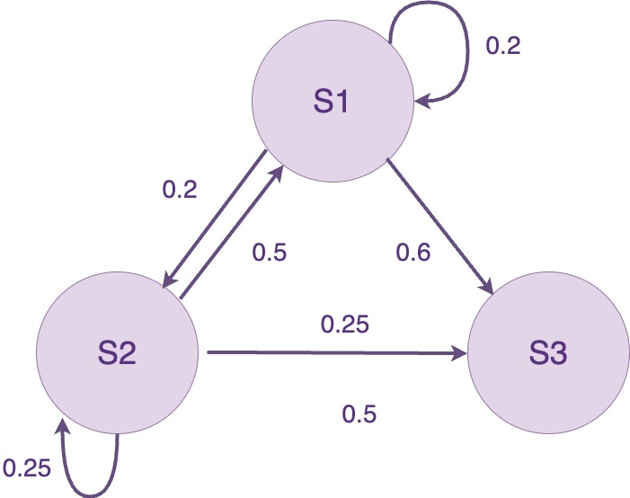
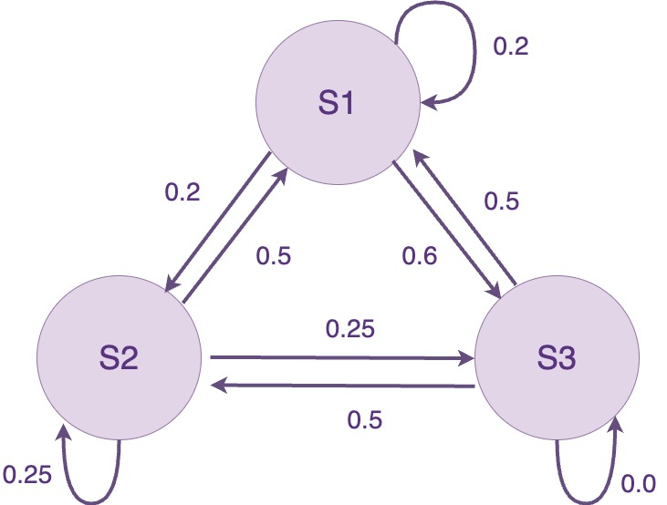

## Outline

In this lab you will:

1. be introduced to several algorithmic composition techniques
2. apply these techniques to automate changes in note-level music

## Introduction

The time has come to dive into [_algorithmic composition_](https://ccrma.stanford.edu/~blackrse/algorithm.html) -- an important aspect of the computer music portion of this course, and of ideas about how we create music - and what music is.

Let's get into what we mean by the term _algorithmic composition_. Well, first of all, what's an algorithm? You can think of an algorithm as a limited set of _instructions_ to follow in order to perform a specific _task_. Since we are working with computers, these _instructions_ will be articulated in our code and the computer will perform the said _task_ by following the _instructions_ we give it.

:::tip
**Algorithms:** More formally, an algorithm is a finite sequence of precise instructions which are used to solve a class of problems. The word algorithm is a latinization of محمد بن موسى خوارزمی - (c780 - c850) or _al-Khwarizmi_, a Persian polymath, whose works also gave us الجبر  (al Jabr, latinized as _algebra_ - the Compendious Book on Calculation by Completing and Balancing), and the Indian numbering system, including decimal notation. The "recipes" in this compendious book are the source of our concept of algorithm. [Khwarazm](https://en.wikipedia.org/wiki/Khwarazm) is, clearly, the name of the region that _al Khwarizmi_ came from.
:::

Naturally, these _instructions_ are independent of the programming language we choose to use. When we talk about algorithms in the context of _composition_, the _tasks_ we want our computer to perform are related to generating changes in the music we compose. This means, the computer automatically generates changes in the music, but it does so based on _instructions_, rules or blueprints we specify through our code.

**do:** To get started, fork and then clone the [lab 15 template repo](), open it in VSCode and start the live server.

## Part 1: Dice Music

Algorithmic composition pre-dates computer music. Since algorithms are by definition a set of instructions, they do not necessarily have to be written in code, and so, they do not necessarily have to be performed by computers. Us fleshy humans are also capable of carrying out instructions! In fact, Mozart was known for composing music which incorporated dice rolls. He would start by creating several different musical phrases. He would then roll a die and the number the die landed on would dictate the musical phrase he began with. With each subsequent die roll, he would select a new phrase and chain it to his composition.

In this activity, we are going to follow in the steps of Mozart and create our own dice music. To keep things simple, we'll just be working with rhythms.

**do:** On a piece of paper, write down 6 different rhythmic sequences over 4 beats. For simplicity, assume every note in your sequence have a duration of one beat. An examples of one four-beat sequence would be `B4, 0hz, 0hz, B4`. Since this sequence is purely rhythmic, we'll use a single note value i.e. `B4` to represent a 'hit' in my rhythm and `0hz` to represent a rest i.e. silence in my rhythm. Write down 6 different sequences like this.

Now that we have a set of 6 sequences to choose from, let's create some instructions to follow which will help us build a composition using these 6 rhythmic sequences. One example of a set of instructions can be derived by assigning each face of the die to one of your sequences[^sequence-map].

[^sequence-map]:
    A dice has six faces and you've written six sequences -- how convenient.

The person next to you is now going to create a composition (i.e. a chain of four-beat sequences) using the 6 four-beat sequences you have created. You should assume they will have a die to roll and that they will select a sequences based on the number which appears on the dice. It's up to you to give them instructions on which sequence to pick when the die shows a `1`, which sequence to pick when the die shows a `2` and so on for each possible number which can appear on the die.

**do:** Under your sequences, on your piece of paper, write down a set of instructions for your partner to follow. Your instructions should 1) tell your partner which four-beat sequence to use next in the composition based on the number they get on a given die roll, 2) tell them when to stop composing (i.e. when to stop rolling the dice and chaining sequences).

:::tip
**talk:** Once you've written down your instructions down on paper, say "Hi" to the person next to you and hand over your piece of paper which has your 6 sequences and your instructions on it. They will probably also hand over a piece of paper to you with 6 sequences and some instructions, so don't be alarmed if this happens :) Simply accept the piece of paper and thank them as you will need it for the next part of this activity.
:::

**do:** On paper, follow the instructions your partner has given you to create a composition. Here is your very own [p5.js die](https://editor.p5js.org/Ushini/full/JbqGVhsaQ) which you can "roll" by clicking on the screen. You should keep "rolling" the die until the stopping condition (which your partner specified) is met. Write the composed sequence at the bottom of the page.

Cool, you just followed an algorithm! Now let's make your computer do all the hard work.

**do:** In your template repo, create a variable for each rhythm sequence on the piece of paper your partner gave you. You can label the variables `R1`, `R2`, `R3` etc. These variables should store each rhythm sequence your partner made as an array of notes/frequencies.

:::tip
**think:** It's time to start thinking about how to translate the instructions you just followed into instructions your computer will understand. To begin with, flip your piece of paper over and write down a rough plan of how you might implement your instructions in code. It's ok if you haven't considered absolutely every detail of how it will work, it's just a _rough_ plan. Once you've done that, call over one of your instructors and go over your plan with them.
:::

**do:** Once you've discussed your plan with one of your instructors, convert the instructions your partner gave you into code. There is a variable called `dieRoll` in your template which will store the result of a die roll i.e. it will take on any of the following values `1, 2, 3, 4, 5, 6`. At the moment, the die roll is being set to a single value at the bottom of the `setup()` function, but we want to mimic more than one die roll, so make sure your code keeps updating this `dieRoll` value until the stopping condition your partner specified is reached. You can store each sequence-selection you make in the `selectedSeq` variable. You can add a selected sequence to the `composition` variable (which is an empty array) using the following code `compositions = compositions.concat(selectedSeq)`.

Awesome work! Now for something slightly different.

**do:** Modify the code you just wrote to select one of the sequences if the `dieRoll` is even and a different sequence if the `dieRoll` is odd? e.g. you only select `R2` and add it to the composition if the die lands on an even number and you only select `R3` and add it to the composition if the die lands on an odd number.

**do:** Once you've finished this activity, please make sure you `commit` and `push` your code to git. We will be modifying it in the next activity and committing and pushing will save the current version of your code.

## Part 2: Markov Chains

### A brief probabilistic detour

When you roll a die, there is an equal chance that it will land on any of it's six faces. In other words, the probability of getting 1 = the probability of getting 2 = the probability of getting 3 = the probability of getting 4 = the probability of getting 5 = the probability of getting 6 = 1/6. What if we wanted to adjust these odds so that we have a higher chance of 'rolling' a 6, and therefore, have a higher chance of picking the rhythmic sequence associated with a die-roll of 6?

```js
let S1 = ["B2", "0hz", "B2", "0hz"]
let S2 = ["B2", "0hz", "0hz", "B2"]
let S3 = ["B2", "B2", "0hz", "B2"]

let sequences = [S1, S2, S3]
```

Let's suppose we have three sequences like the ones above; `S1`, `S2` and `S3`. If I want to pick one of these sequences at random, I could begin by using the `random()` function to select a number between `1` and `3`. The `random()` function will then give me either a `1`, a `2` or a `3` with equal probability. If I get a `1`, then I pick `S1` and if I get a `2` I pick `S2` and so on. There is an alternative way we can use the `random()` function to select one of these three sequences with equal probability.

If we give the `random()` function an _array_ e.g. `random([1,2,3,4])` instead of a range e.g. `random(1,7)`, then the random function will select an element from that array with equal probability. So when calling `random([1,2,3,4])`, the probability of selecting 1 = the probability of selecting 2 = the probability of selecting 3 = the probability of selecting 4 = 1/4.

You'll see that there is another variable in the code snippet above called `sequences` which stores each of our sequence arrays within it. If we pass the `sequences` array to our `random()` function, it will directly select one of our sequence arrays at random. This is nice because we don't have to go through this business of picking a number first and then checking which sequence matches which number.

```js
console.log(random(sequences))
```

**do:** Copy the block of code above which contains the arrays `S1`, `S2`, `S3` and `sequences` and paste it into your template repo, where you would normally declare variables. Then copy the line of code above which calls `console.log` and paste it at the bottom of your `setup()` function. Open the console in your browser and watch how the result of `random(sequences)` changes as you refresh the page.

:::tip
**think:** How can you modify your code so that your chances of selecting `S2` is three times as likely as your chances of selecting `S1` or `S3`?
:::

**do:** Modify your code so that your chances of selecting `S2` is three times as likely as your chances of selecting `S1` or `S3`?

### Markov Chains

:::tip
**extension:** The rest of this lab is a bit of an extension, so don't worry if you don't finish. Having said that, you are all capable of giving the rest of the exercises a go. They're not 'difficult', this lab would just be _very_ long if we asked you to complete the whole thing in two hours :)
:::

In the previous activity, we found a way of increasing the chances of some events happening over others i.e. we had a higher chance of selecting `S2` over the other sequences. This is exactly how weighted die work. A weighted die is filled with heavier material near one of it's faces e.g. `2` so that it's more likely to land with the `2` facing down. What if the chances of selecting a given sequence _also_ depended on the last sequences you picked?

Here is an examples of how the probabilities might depend on the previously selected sequence. Let's say the last sequence I picked is `S1`. Then my next selection would be governed by `sequences = [S1, S2, S3, S3, S3]`; so `S3` is thrice as likely to be selected as `S1` or `S2`. Now let's suppose the last sequence I selected was `S2`. Then my next selection would be governed by a new array e.g. `sequences = [S1, S2, S1, S3]`, where `S1` is twice as likely to be selected as `S2` or `S3`.

In this example, it is as though you are rolling a weighted die each time you make a selection of a sequence, but the way the weight is distributed on the die depends on which sequences you picked last. The weight distributions here are determined by what the `sequences` array looks like e.g. `sequences = [S1, S2, S3, S3, S3]` or `sequences = [S1, S2, S1, S3]`.

Since it's kind of a pain to keep updating our `sequences` array each time you make a selection, we can alternatively represent the "rules" for our sequences selection as an _array of arrays_. This _array of arrays_ is what we will refer to as a _Markov Chain_.



```js
markovChain = [[S1, S2, S3, S3, S3],
               [S1, S2, S1, S3]]
```

The first element of the Markov Chain above is the array `[S1, S2, S3, S3, S3]` and we can access it using the notation `markovChain[0]`. Based on the example above, if the previous sequence we chose was `S1`, we would only make our next selection based on `markovChain[0] = [S1, S2, S3, S3, S3]` and so, when we make our next selection, we use `random(markovChain[0])`. This is exactly the same as using `random([S1, S2, S3, S3, S3])`.

:::tip
**talk:** With the person next to you, discuss how you might use the `random()` function and the `markovChain` above to select the next sequence in a composition if the previous sequence was `S2`.
:::

The `markovChain` array above is kind of incomplete. This is because the first element is associated with `S1`, the second element is associated with `S2` but there is no element associated withe `S3`. This means that if the last sequence we picked was `S3`, there is no element in our `markovChain` we can use to select the next sequence. The diagram below depicts the Markov Chain in it's complete form (note: some sequences have a zero probability of being selected twice in a row).



**do:** In your code, modify the `markovChain` array so that it reflects the completed Markov Chain diagram above.

**do:** Once your `markovChain` is complete, create a composition by chaining 10 sequences together. The composition must start with `S1` and you should select the subsequent sequences to chain based on the `markovChain`.

**do:** Once you've completed Part 2, please `commit` and `push` your work to git. Pretty please!

## Optional homework for next week

We will be applying algorithmic composition techniques to create soundscapes using samples in next week's class. If you want to, collect some field recordings (using your phone) of any interesting sounds you hear. You can upload the audio files somewhere you can access easily during class next week.

## Summary

Congratulations! In this lab you:

- were introduced to several algorithmic composition techniques
- applied these techniques to automate changes in note-level music
