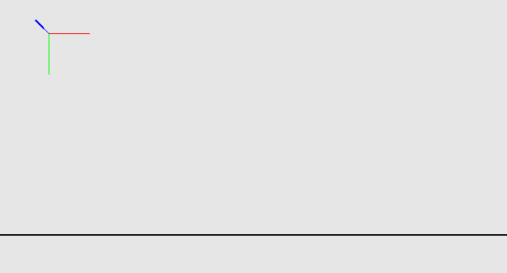
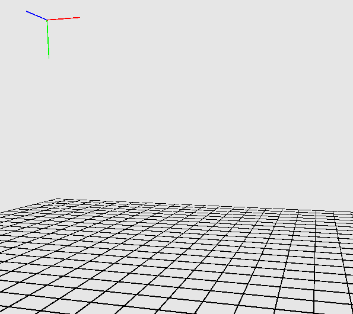
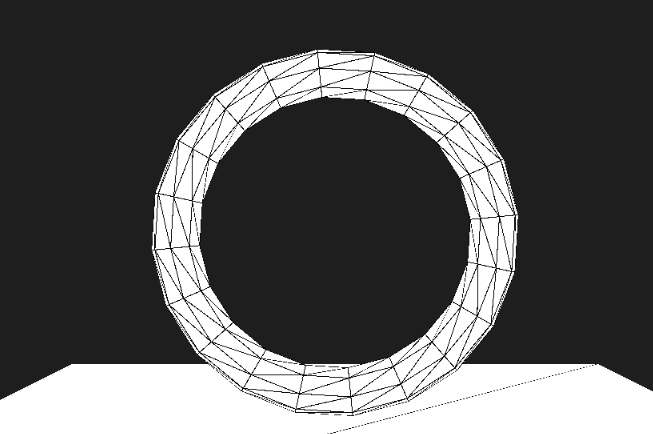

## Outline

In this lab you will:

1. Understand the concepts of dimension in art, graphics and mathematics
2. Investigate the requirements for 3 dimensional graphics
3. Get started with creating 3D environments in code

## Introduction

Welcome back Creative Coders! I trust you all had a lovely holiday season. :)
We're eager to get back into the swing of things with this course as we start
a new module of EXTN1019. This term, we will be working with 3D graphics in
[p5.js](https://p5js.org) &mdash; and in term 2 we will investigate a new Javascript
library called [ml5.js](https://ml5js.org/). 

As you work through the lab, it'll be helpful to have the p5.js [Shape, 3D Primitives references](https://p5js.org/reference/#Shape)
open in a new tab so you can refer to it easily.

It will also be useful to have the p5.js [3D reference](https://p5js.org/reference/#3D) open, as this provides guidance on different aspects of rendering and interaction.

## Getting Dimensional

### What is a dimension?
What do we mean by dimension? What are all the meanings of this word? What is associated with dimension? How many dimensions can we have?

:::tip
Choose one of the following: (A) Write down all the **meanings** of the word *"dimension"*. (B) Think of, and write as a word cloud, all the words you can that you **associate** with the word *"dimension"*. (C) Find a precise **mathematical definition** of *"dimension"* [4 minutes]
:::

Share your findings with the class. We will have a discussion about the meanings of dimension, fitting as much as we can into a time box of 5 minutes.

### How many dimensions?
Let's take a closer look into what we mean by dimension through some concrete examples.

:::tip
**Think:** What does a 1-dimensional object look like? What are some examples of 2-dimensional objects? Can you have a 0-dimensional object? Do you know your 3d platonic solids? Are 4-dimensions possible: if so, what do these objects look like? Is there a limit to the number of dimensions? Can you have fractional dimensions?
:::

Share your findings with the class. We will have a discussion about types of 0D, 1D, 2D, 3D, 4D and other types of dimensional spaces, fitting as much as we can into a time cube of 4 minutes.

### Artistic Dimensions
OK: so now we have some working definitions of dimension. Lets look at dimensions in art, design and graphics.

:::tip
Research: when did people start using aspects of dimension in art and design? When did they start using three dimensional representations of the world on two dimensional canvases? How do we know? What other meanings do we attribute to relative size, position, occlusion? What are the elements of 3-dimension representations of the world?
:::

Share your findings with the class. We will have a discussion about how 3D space is represented on a 2D space, fitting as much as we can into a time bubble of 5 minutes.

Suggested Resources:
* Janson, J.(2025), [The History of Perspective](https://www.essentialvermeer.com/technique/perspective/history.html), Essential Vermeer 5.0
* Lienau, L. (2013) [A Brief History of Perspective](https://www.classicalart.org/blog/a-brief-history-of-perspective), Oklahoma Academy of Classical Art
* Op-art.co.uk (2025) [Op Art History Part I: A History of Perspective in Art](http://op-art.co.uk/history/perspective/)
* Wikipedia (2025) [Perspective (graphical)](https://en.wikipedia.org/wiki/Perspective_(graphical))

## Coding Dimensions
OK: So we now have an understanding of how we represent our world in 2D. Why not just take a photograph (ouch to the painters: how does photography turn 3D into 2D? Do sculptors reign supreme: they provide a 3D representation of a 3D world)?

Let's take a look at code for 3D.

Fork, Clone and open this lab's [template repository]():

Run the code. What do you see?

Let's look at what has changed and what is needed for 3D

### WEBGL
```js
createCanvas(windowWidth, windowHeight, WEBGL);
```

[WebGL](https://developer.mozilla.org/en-US/docs/Web/API/WebGL_API) is a JavaScript API for rendering 3D [and 2D] graphics in compatible Web Browsers. NOTE: compatibility is dependent on web browser, browser version, browser platform, and specific function used. The use of standard interface APIs within WebGL can enable hardware rendering [using the graphics card capabilities of the end-user platform]. This makes guaranteeing successful applications problematic: do you really want to force everyone to use a specific version of Chrome?

Adding **WEBGL** as a parameter to createCanvas tells p5.js that we are intending to use 3D graphics and/or the capabilities of WebGL.

## Drawing vs Rendering
### 2D Drawing
When drawing in 2D we write code such as: 
```js
circle(x,y,radius);
```
Which draws a circle at the specific coordinates (x,y) with a given radius on the 2D plane of the canvas. By default, the "origin" of the canvas is the top left corner of the canvas. x-values increase from left to right, y-values increase from top to bottom.

### 3D Rendering
In our 3D environment, we place objects in a 3D coordinate space. These are viewed through a virtual "camera". The scene is lit using specific lights. The objects can have a range of materials applied to their surfaces. The 3D renderer (WEBGL) "renders" the image using all of this information (camera position, camera direction, camera field of view, light positions, light directions, light colours, object positions, object orientations, object materials, object occlusion). This is a radically different way to see the world. The same scene can be changed through moving the camera, altering the lights, altering materials, and altering positions of objects.

The origin point is represented by the coordinates (0,0,0). This **may** be in the centre of the screen. But that does depend on where the camera is pointing, and the orientation of the camera.

### Visualising the Environment



```js
debugMode();
```
Turns on debugMode. This places a ground grid in the scene, and also a set of coordinate axes (you may need to move objects or the camera to see these). This is to help you understand how things are positioned.
Once you have turned it on, you need to call `noDebugMode()` to turn it off.  See [`debugMode()`](https://p5js.org/reference/p5/debugMode/) for more information.



```js
orbitControl();
```
Turns on a set of default interactions. It is also very helpful for visualising the environment. You can rotate and move the camera using the mouse position, left mouse button, and scroll wheel.
See [`orbitControl()`](https://p5js.org/reference/p5/orbitControl/) for more information.

## Lights

In our 3D world, lights provide a source of illumination for 3D surfaces. They control the appearance of a surface - a brighter light will "flood" the surface with light, and a dimmer light will render the same surface in dark tones.  Lights have a colour property - they do not have to be "white", nor full brightness intensity.

Lights DO NOT have associated geometry. You cannot "see" the source of a light, unless you choose to add geometry to represent the light source. In other words, you can create sunlight without adding a sun image/sphere.

### No lighting
It is possible to use 3D graphics with no lights. Objects will be rendered using solid colour and do not respond to their environment. Solid colour does not provide any shading, so it is useful to have `stroke()` applied to have some sense of shape.

### Default lights

```js
lights();
```
The function [`lights()`](https://p5js.org/reference/p5/lights/) creates 2 default lights for your scene. One is an ambient light, and the other is a directional light. Like `debugMode()` and `orbitControl()`, the use of lights is very handy for visualising your scene, but does not provide you with the ability to control the appearance.

Lights interact with materials. If a material does not respond to the lights you have created, then your object will render "dark", or even completely black.

`lights()` creates 2 types of lighting so that both ambient materials and specular materials are rendered.

### Ambient Light
The word *ambient* means, in this context, *"surrounding"*. An ambient light creates a light source that shines evenly on all 3D faces. Our "real world" does not have ambient light - as even diffuse indoor lighting, or the diffuse light on a cloudy day, still has a primary directional source, and sides of objects away from this light will be darker then sides which face the source of the light (e.g., towards the sky on a cloudy day). 

Ambient light interacts with `ambientMaterial()`. If you created a red ambient light, and had an object with a green ambient material, the object would not respond to the light.

Read more about [`ambientLight()`](https://p5js.org/reference/p5/ambientLight/) here.

### Directional Light
We will look at lights in more detail in future labs. [`directionalLight()`](https://p5js.org/reference/p5/directionalLight/) is a type of lighting created by the function `lights()`. It is a light that shines with unvarying power from a given direction. Useful for simulating powerful remote light sources, such as a sun.

### Point Light
In the code you can see that, as an alternative to `lights()`, there is an option of creating specific lights.
```js
  ambientLight(30, 30, 30);  // the lightness of the world
```
and
``` js
  pointLight(180, 180, 180, locX, locY, 200);  // like a torch
```
A [`pointLight()`](https://p5js.org/reference/p5/pointLight/) is like a light bulb or candle. It issues light from a point source that shines in all directions from that point. The strength diminishes with distance.  The way objects light up from a pointLight is dependent on their relative position.  

NOTE: Point lights do NOT cast shadows.  Objects are lit from a point light source as if there were no other objects in the scene.

NOTE: By using locX and locY, which are defined using the mouseX and mouseY, the position of the pointLight moves with the mouse.

Light References:
* [ambientLight](https://p5js.org/reference/p5/ambientLight) &mdash; uniform lighting that shines on all surfaces in a scene
* [directionalLight](https://p5js.org/reference/p5/directionalLight) &mdash; a light that shines on all surfaces from a specified direction (like a powerful remote light source - such as the sun)
* [pointLight](https://p5js.org/reference/p5/pointLight) &mdash; a light that shines from a specific 3D point source. It shines out from that point in all directions. 
* [spotLight](https://p5js.org/reference/p5/spotLight) &mdash; simulates a spotlight - shines from a specified point, in a specified direction, with a specified cone angle
* [imageLight](https://p5js.org/reference/p5/imageLight) &mdash; useful for reflections
* [lights()](https://p5js.org/reference/p5/lights) &mdash; a shortcut for calling both ambientLight() and directionalLight() with default values.
* [noLights()](https://p5js.org/reference/p5/noLights) &mdash; removes all lights from a scene. Object are rendered using fill() colour.
* [lightFalloff()](https://p5js.org/reference/p5/lightFalloff) &mdash; sets the way light intensity reduces with distance for spotLight() and pointLight().

We will look at other types of lighting in subsequent labs.

## Coordinate Systems
### X, Y and Z 
```js
translate(0, 250, 0);
```

we use the same methods for moving (translate), rotating (rotate) and resizing (scale) objects. But now we add a third dimension to the transform matrix: Z.

:::tip
**Discuss with a partner**: Which way is Z? Which way is positive and which way is negative?
:::

```js
rotateX(PI/2);
```
As well as **rotate(theta, axis)**, there are methods for **rotateX(theta)**, **rotateY(theta)** and **rotateZ(theta)**, which may make it easier to think about rotating about a single axis.

:::tip
What are we rotating about X? What is the degree of rotation?
:::

Uncomment the line: ```// rotateY(frameCount*-0.04);``` to view the impact of another translation.
Add a rotation about X.  Experiment with rotation rate. Can you rotate the plane in a different way?

### 3D Primitives

```js
plane(1000, 1000);
```

A plane is a 2D shape. But we are drawing it in a 3D space - so it is no longer simply a flat canvas aligned with your computer's screen. It is now a surface which can be manipulated and rendered in different ways. It can be used to form backdrops for a scene.

```js
torus(200, 30, 12, 12);
```

A torus is a donut. It is a cylinder which has been bent around so one end touches the other. It is a shape described by a circle which has been rotated 360 degrees about a point outside the circle. It is more topologically interesting than a box, sphere, cylinder, cone or ellipsoid.

A torus has a number of properties: 
* radius (or ring radius) - the radius of the entire ring
* tubeRadius - the radius of the tube
* detailX - the number of segments in the x-dimension
* detailY - the number of segments in the y-dimension

The torus will be drawn at the current location (after applying translate()), using the current rotations (in X, Y and Z), scales, and shears.

It is vital to use push() and pop(), OR applyMatrix() and resetMatrix() to control where and how the 3D object is drawn.

Add another object type (box, sphere, cylinder, cone or ellipsoid). Add a transform for that object.  Add as many objects as you like.  Compose a 3D scene.

## Making it Real

Does your 3D world look like this:


Let's try to make it a little smoother.

### To Stroke or Not to Stroke?

In order to display a more sophisticated image, we should get rid of the black lines which define the edges of our 3D surfaces using:
```js
noStroke();
```

### Cameras
We view our world through a camera. The camera has a range of properties, but key amongst these is the position of the camera, the direction the camera is pointing, and the orientation of the camera in 3D space.  As we have not defined a camera, we get the default camera.

### Material People
Lights interact with surface materials. There are a number of elements to materials, and for now we will keep this simply to:

[**ambientMaterial**](https://p5js.org/reference/p5/ambientMaterial)

```js
ambientMaterial(250, 150, 200);
```

ambientMaterials interact with (reflect) ambient light. The reflection is flat/matte.

[**specularMaterial**](https://p5js.org/reference/p5/specularMaterial)

```js
specularMaterial(100, 200, 200);
```

specularMaterials interact with ambient light, spot lights, point lights and directional lights. The reflect light with an aspect of "shininess": the reflections reflect light colour and surface colour. The level of shininess can be controlled using the [**shininess()**](https://p5js.org/reference/p5/shininess) function.

Uncomment all commented lines. Notice the materials and the impact of changes. Change material colours, light colours, glossiness. Play with rotation and transformation.  Add more detail to the torus.

:::tip
What type of interaction might work with this. Add some interaction for a mousePress event.  You can switch off `orbitControl()`, or build upon this.
:::

:::tip
Can you combine 2D and 3D drawing in a scene?  What happens? Is it what you expected? What effect does fill() have on rendering?
:::

## Research

You may already know about different methods for rendering 3D environments.

What does p5.js use for rendering its 3D environment?

How do these techniques work? When were these techniques invented? Why doesn't p5.js use more realistic rendering techniques? Who was Bui Tui Phong?

## Prep for next week

Next week we will be exploring materials and geometries in greater detail. You might want to explore these areas of p5.js during the week.

Remember to commit your code and push it up to Gitlab.

## Summary

Congratulations! In this lab you:

1. Explored the concepts of dimension in art, graphics and mathematics
2. Investigated requirements for creating 3D graphics
3. Used WEBGL with p5.js to create 3D objects, lights, materials and transformations
