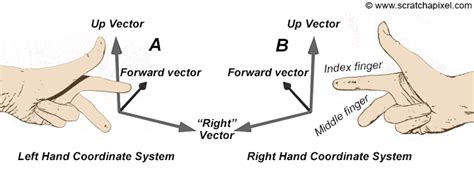

## Outline

In this lab you will:

1. Understand the concepts and complexity of transformations in 3D spaces
2. Understand order of transformations
3. Get started with 3D transformations in code
4. Get familiarised with the first assignment

## Administrivia

### BSSS Unit Outline

The Unit Outline has been [published on this site](/images/docs/Creative-Computing-EXTN1019B-ANU-Ext-Yr12-2025-Unit-Outline.pdf) and on our [Wattle page](https://wattlecourses.anu.edu.au/course/view.php?id=44702).

It contains the:

- unit goals
- content descriptions
- achievement standards
- assessment tasks
- unit planner / calendar

Please read through the [Unit Outline](/images/docs/Creative-Computing-EXTN1019B-ANU-Ext-Yr12-2025-Unit-Outline.pdf) and ask questions.

### ANU Course Outline

ANU has a separate set of standards for recording this information.

This is detailed on the [Course Outline](/outline/#extn1019b-creative-computing) page.

### Deliverables

The [Deliverables Page](/deliverables-year-12/) contains a list of the assessment tasks, and a calendar of release and submission dates.

Tasks will be published to Wattle during the year.

## Introduction

Moving around in 3D spaces appears natural to us, until we try to describe this motion in code!
As you work through the lab, it'll be helpful to have the [p5.js Transform references](https://p5js.org/reference/#Transform)
open in a new tab so you can refer to it easily.

## Coordinate Systems

When coding in 2D, 1 unit == 1 pixel wide or 1 pixel high. How wide/tall/deep is "1" unit in a 3D scene?

As discussed last week - we have 3 dimensions. The width of the web browser window defines the maximum dimension width in the "Z zero plane". X == 0 is in the middle of the window!

Similarly, the height of the web browser window defines the maximum dimension height in the "Z zero plane", and Y == 0 is in the middle of the window. Note, as for 2D graphics, **increasing Y values go down, decreasing Y values go up**. This is counter-intuitive and runs contrary to most other 3D graphics systems.

Increasing Z values move towards to viewer, and decreasing Z values move away from the viewer. This makes the coordinate system **"left-handed" with the middle finger pointing down**.

:::info
There are 2 possibilities for 3D coordinate systems based on which way the Z-axis points for positive z-values. We use _"handedness"_ to describe this. From the xy plane, increasing z-values can go "outwards" or "inwards". In Maths, Physics and Chemistry, it is usual to use the index finger for X, the middle finger for Y and the thumb for Z. In computer graphics and games discussions, they will often use thumb for X, index finger for Y and middle finger for Z, but the concept is transferrable.
:::




When you use models imported from other systems, you need to be aware of the sizes (how big is the model in units in the original system), the handedness, and the fact that Y points down. You will need to scale and reflect or rotate your imported model to match p5.js.

## Transformations

### What is a transformation?

What do we mean by Transform and transformation? What are all the meanings of these word? Which words do you associate with transformation?

:::tip
Choose one of the following: (A) Write down all the **meanings** of the word _"transformation"_. (B) Think of, and write as a word cloud, all the words you can that you **associate** with the word _"transformation"_. (C) Find a precise **mathematical definition** of _"transformation"_ [4 minutes]
:::

Share your findings with the class. We will have a discussion about the meanings of transformation, fitting as much as we can into a time box of 5 minutes.

### Types of transformation in 3D computer graphics

Let's take a closer look into what we mean by transformation through some concrete examples.

:::tip
**Think:** If a **Transformation** is a **function** that maps a set X to itself:
$$f \left( X \right) \Rightarrow X$$ then how is a rotation a transformation?
:::

### Lost in Translation

A **translation** is a transformation that changes the values of each point through adding a single vector to each point. The effect is that the object as a whole is **moved** in space without changing shape. Moving objects in space is also called translating an object.

### Scale it up

A **scale** transformation uses a matrix multiplication to change the size of an object. This can be applied in 1 dimension (stretching/squeezing an object along an axis), 2 dimensions (stretching/squeezing along 2 axes), or in 3 dimensions (retain original shape, but increase/decrease in size).

### Shearing

A **shear** transformation is a non-uniform translation which creates a _"slant"_ to an object's geometry.

### Reflection

A reflection transformation creates a mirror image of the original object when reflected along an axis. This is achieved through a matrix multiplication. If the object is oriented along a coordinate axis, the axis values can be multiplied by `-1`.

### Spin it around

Rotations are the most complex of the transformations. Rotations also use a matrix multiplication to transform all the points of an object such that they describe a circular motion around a point with a given axis of rotation (a vector that points in a specific direction).

### Uses of Transformation

- **Translation** can be used for positioning objects in a scene: for example, setting up a scene.
- **Scale** can be used to create objects of many different sizes
- **Rotation** can be used for orientating objects in a scene
- **Animation:** all transforms can be changed over time to animate a scene

### Order of Transformation

In Mathematics we use BOMDAS, BODMAS, PEMDAS or PEDMAS to talk about the order of operations. We have learned that addition before multiplication creates a different result to addition after multiplication. Transformations use matrix addition and multiplication. So - it should be expected that the order of operations matters: and it does. We will explore order of transformation in the coding activities.

## Coding Transformations

Let's explore code for 3D transformations.

Fork, Clone and open this lab's [template repository]():

Run the code. What do you see?

> _Note:_ We will also look at different types of models and materials in today's lab. This model is standard geometry, known as Suzanne, from Blender 3D. You can see that the model is not oriented as might be expected.

> [_debug mode:_](https://p5js.org/reference/#/p5/debugMode) Displays standard axes to help you visualise and a ground grid plane.

> [_orbitControl:_](https://p5js.org/reference/#/p5/orbitControl) Enables easy interaction for rotation of view, zooming and panning of camera.

### Scale it right

To make the model bigger - you can scale it:

```js
scale(2, 2, 2); // scale by a factor of 2 in all dimensions
```

To invert the model, you can achieve this using a scale factor of -1 to flip coordinates.

```js
scale(1, -1, 1); // mirror in the Y axis using a -1 scale factor
```

:::tip
**Think:** Can you complete the 2 operations in a single function call?
:::

### Order, order...

Let's animate the model to more easily illustrate order of operations

```js
rotateY(frameCount * 0.01);
```

Now try adding the translate:

```js
translate(0, 0, 200);
```

Try putting it before the rotate. Before the scale.

Now add a rotation around X or Z. Add another translate.

What did you find? How does this impact your thinking?

There are other ways to create transformations: you can manipulate the transformation matrix directly through applyMatrix(). This enables you to build sophisticated transformation strategies, including using quaternions for rotations.

## Quaternions

If you like getting technical then this is for you.

I mentioned in Lab 1 that quaternions were superior to rotation about X, Y, and Z when working with 3D rotations.

The problem encountered with rotating separately around X, Y and Z-axes to build up a complex 3D rotation is that if/when 2 of the axes become aligned after initial rotation about an axis, then subsequent rotations about the aligned axes are identical. This is known as [**Gimbal Lock**](https://en.wikipedia.org/wiki/Gimbal_lock).

One way to avoid Gimbal Lock is to use [Quaternions](https://en.wikipedia.org/wiki/Quaternions_and_spatial_rotation) for rotations. This effectively adds another dimension (4-dimensional space).

The p5.js code library has a class for Quaternion rotation. I have also provided an implementation of a Quaternion class.

You might wish to investigate the issues you might encounter in rotations, and explore whether quaternions provide a solution to these issues, or if they add other issues.

Your code investigation might compare rotateX, rotateY, rotateZ with quaternion rotation. You code and discussion should demonstrate the issues, and benefits. Your research should focus on quaternion rotation.

## More Models

The lab template has included a range of models for you to investigate.

### p5.js 3D models

All of the p5.js 3D models include the optional parameters of **detailX** and **detailY** which determine how many subdivisions are applied the the geometry. More divisions == smoother geometry, but higher rendering times.

- box: a rectangular prism (width, height, depth)
- plane: a zero thickness 2D plane (width, height)
- sphere: (radius)
- cylinder: (radius, height, dx, dy, topCap, bottomCap) topCap an bottomCap are booleans which define whether or not the cylinder has 2 closed ends, 1, closed end or no closed ends
- cone: (radius, height, dx, dy, cap)
- ellipsoid: (radiusX, radiusY, radiusZ)
- torus: (radius, tubeRadius)

### Importing Geometry

As well as the basic 3D objects provided by p5.js there is also "loadModel()" - as you have already discovered - it loads a prebuilt model constructed using a 3D graphics program.

- loadModel(model filepath on web server): loads a geometry file of a supported type (OBJ or STL). Always load geometries in the preload() function.
- model(modelObject): render the model

Remember to commit your code and push it up to Gitlab.

## Assignment Task One

The first assignment requires you to research and explore an aspect of 3D graphics.

You will discover the history of that aspect, report on this, and create a work of art that embodies this aspect of 3D graphics.

Suggested topics include:

- Which geometry is orthodox? The mathematics of 3D graphics.
- 3D modelling techniques (how do we construct complex geometries)
- Transformations (Quaternions)
- Cameras and Lighting
- Shading, Textures, Materials
- Recent graphics developments (SIGGRAPH)
- Principles of Traditional Animation Applied to 3D Computer Animation
- A 3D graphics/virtual worlds artist and their work

You do not need to write a complete history of your chosen topic. Choose one element (for example, instead of "shading", choose "Phong shading"), and explore that topic deeply.

Read the [specification for Assessment Task 1 / Portfolio Item 1 here](/deliverables-year-12/01-3d-research-topic/)!

## Summary

Congratulations! In this lab you:

1. Explored the concepts of 3D coordinate systems and transformations
2. Coded 3D transformations
3. Further explored 3D geometries and standard p5.js materials

## Additional Learning Resources

### p5.js

- [3D coordinates and transformations](https://p5js.org/learn/getting-started-in-webgl-coords-and-transform.html)
- [Styling and Appearance](https://p5js.org/learn/getting-started-in-webgl-appearance.html)
- [Creating custom geometry](https://p5js.org/learn/getting-started-in-webgl-custom-geometry.html)

### coding train

- [WebGL Track](https://thecodingtrain.com/tracks/webgl)
