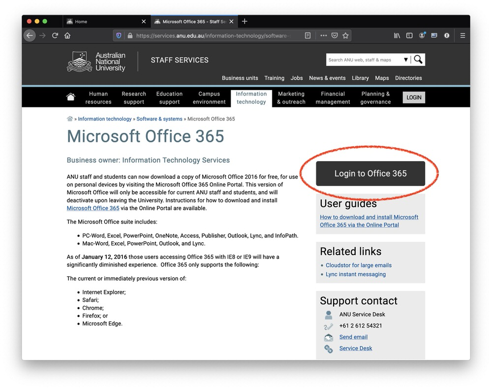
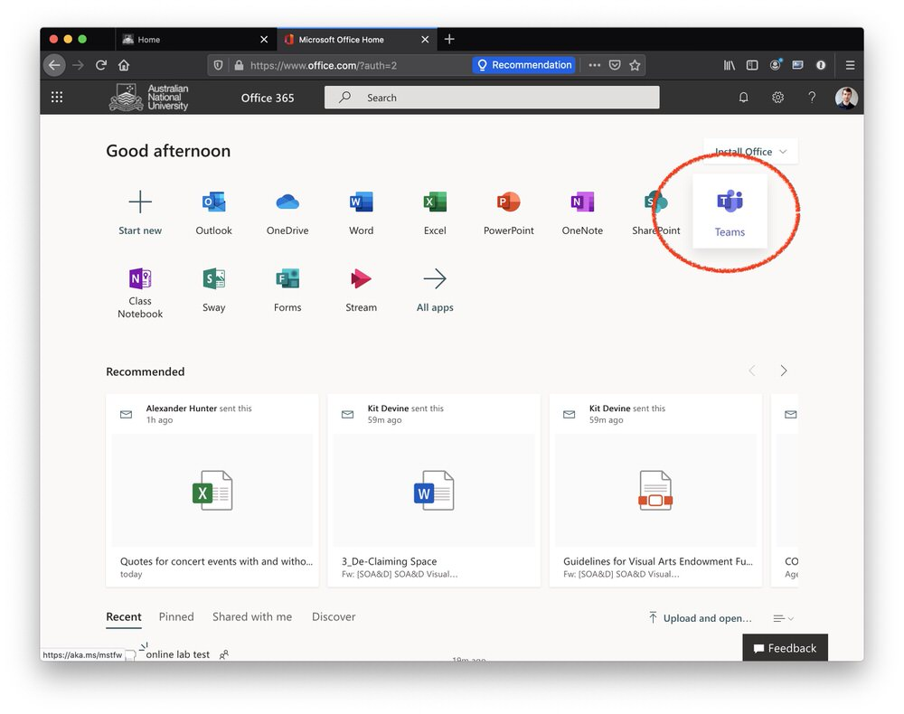
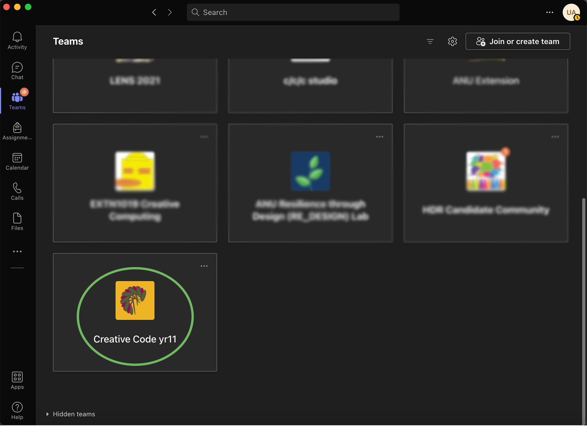
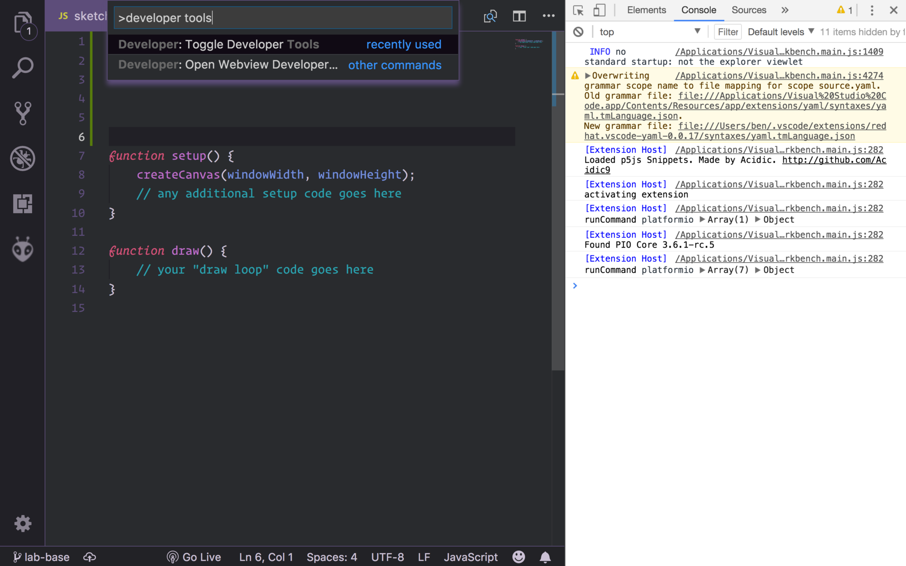

## Visual Studio Code (VSCode) {#vscode}

The Integrated Development Environment (IDE) we use in EXTN1019 is [Visual
Studio Code](https://code.visualstudio.com/) (we'll usually call it **VSCode**
for short). VSCode is a "text editor" program, which means that it's really good
at editing text, but doesn't care too much what that text is or what it means.
It's equally happy if you're writing the great Australian novel, or a shopping
list, or a bunch of computer code.

However, VSCode also allows people to write "extensions" to help VSCode write &
run code for different programming languages---including p5.js. That's why
VSCode is the program you'll be using in EXTN1019 to write all the code for your
p5 sketches. Don't worry if you've never used it before, the lab material will
walk you through how to create interactive artworks in javascript.

### VSCode setup

:::info
If you're on one of the ANU lab machines (either in the CSIT or Peter Karmel
buildings) then most of this is already done, although you _may_ have to install
the **extn1019** VSCode extension---jump to step 3.
:::

To set this all up on a new machine (e.g. your own laptop) here are the steps:

1. [download & install VSCode](https://code.visualstudio.com/) (works on macOS,
   Linux & Windows)

2. open VSCode, [open the **Extensions**
   view](https://code.visualstudio.com/docs/editor/extension-gallery) (_View >
   Extensions_ in the menu)

3. search for and install the [EXTN1019
   extension](https://marketplace.visualstudio.com/items?itemName=anucecsit.vscode-extn1019)
   (version `` is currently the latest version)

4. reload the VSCode window (using the [command
   palette](https://code.visualstudio.com/docs/getstarted/userinterface#_command-palette))

VSCode has [pretty good documentation](https://code.visualstudio.com/docs) (the
cool kids sometimes call documentation "docs" or "doco" for short) and the lab
material will link to specific parts of it where appropriate. However,
understanding your tools is really important, so take the time to read through
the documentation and get to know the features of VSCode. It'll make your life
easier in the end, even if there's a learning curve at the start.

Once you've got VSCode & the necessary extension installed you're able to create
your first p5.js sketch. That's what the first lab is all about---so head [to
that page](/labs-year-11/01-intro/) and give it a try.

## Firefox {#firefox}

I'm guessing you know what a web browser is, right? And that you can download
and install Firefox from the [download
page](https://www.mozilla.org/en-US/exp/firefox/new/)? Great :)

What you might not be aware of is that Firefox (in fact, all modern web
browsers) also contain a programming language---javascript---which is the
language you'll use to build your interactive art sketches in this course. As
well as just running javascript programs, they also have tools for inspecting
and debugging them (in Firefox, they're called the [Firefox Developer
tools](https://developer.mozilla.org/en-US/docs/Tools)).

You can access the Firefox developer tools through the `Tools > Web Developer >
Toggle Tools` menu, and there's a keyboard shortcut as well
(<kbd>cmd</kbd>+<kbd>option</kbd>+<kbd>I</kbd> on macOS,
<kbd>ctrl</kbd>+<kbd>shift</kbd>+<kbd>I</kbd> on Windows/Linux). In this course
we'll use the `Console` and `Sources` tabs in particular. Don't worry if this
all seems confusing at the moment, we'll step you through it in the labs.

## git {#git}

[git](https://git-scm.com/) is an amazing bit of software for storing and
tracking changes to your code; you can think of it as Dropbox (or Google Drive
or iCloud etc.) on steroids. It's also the way you'll submit your assignments in
this course, but don't worry if you haven't used it before. You'll have plenty
of time to practice before the first assignment is due.

The GitLab website help pages have some instructions for getting set up with git
on your computer, in particular:

- [opening up a command
  shell](https://gitlab.cecs.anu.edu.au/help/gitlab-basics/start-using-git.md#command-shell)
  (you won't need to use this method once you've got your git<->VSCode
  integration sorted out, but it can be handy at the start)
- [installing
  git](https://gitlab.cecs.anu.edu.au/help/topics/git/how_to_install_git/index.md)
  (with different instructions for Windows, macOS and Linux)

- [configuring
  git](https://gitlab.cecs.anu.edu.au/help/gitlab-basics/start-using-git.md#configure-git)
  (this can be handy if you're getting "git doesn't know your name" errors)
- [adding an SSH
  key](https://gitlab.cecs.anu.edu.au/help/ssh/README.md#adding-an-ssh-key-to-your-gitlab-account)
  (so that you don't have to type in your password every time you want to do git
  stuff)

There are lots of other resources on the web for setting up git on your machine,
so you can google around for tips on solving the specific error messages you're
seeing. As always, if you get stuck you can reach out for help on [Teams]({{site.teams_url}}).

:::warning
After installing Git, you'll need to close and re-open VSCode!
:::

## Microsoft Teams {#teams}

EXTN1019 has a dedicated [Microsoft Teams]({{site.teams_url}}) channel. You
can access Microsoft Teams through the [ANU Office 365
homepage](https://services.anu.edu.au/information-technology/software-systems/microsoft-office-365),
just click "Login to Office 365" on that page and sign in with you uni ID and
password.



You can go to the Teams app right in Office 365. While you're in Office 365, why
not [**update your
avatar**](https://support.microsoft.com/en-us/office/add-your-profile-photo-to-microsoft-365-2eaf93fd-b3f1-43b9-9cdc-bdcd548435b7)
to a friendly picture of yourself so we know who you are?



If your MS Teams account is subscribed to more than one channel, you can always
find EXTN1019 in your Teams main screen:



Microsoft Teams works best as an application installed on your computer. Hit the
"Download app" button to get it installed.

## Troubleshooting

If you're having problems on your own laptop then there are lots of different
things which might be causing it, and it's too hard to list them all.

Here's a list of issues you might come across, depending on the specific details
of your machine. A small word of warning: it's always try to understand the
problem first before you try randomly copy-pasting the various solutions listed.
If you're totally lost, remember to hit us up on [Teams]({{site.teams_url}})
and we can help you out.

### VSCode {#troubleshooting-vscode-plugins}

If VSCode isn't working as you'd expect (e.g. you can't install the EXTN1019
extension pack, or you think you've installed it but you can't see the **Go
Live** button down the bottom, or some other issue) then the most helpful place
to check is the VSCode Developer Tools.

These aren't super-easy to find, the best way to bring them up is to use the
command pallette and search for the _Toggle Developer Tools_ command (as shown
in the screenshot below). Once you do this, you'll see a console window show up
in your VSCode window (shown here on the right, but it might be on the left, or
on the bottom depending on your settings---it doesn't matter).



In the screenshot (taken on my machine) there's a bunch of log messages from
VSCode which you don't need to understand, and that's normal. What might be a
worry, however, is if there are a bunch of angry-looking red error messages.
They still might not make any sense, but that's the best place to see exactly
what VSCode is complaining about, and at least it gives you something to paste
into Google so that we can figure out exactly what's going wrong.

If you're curious as to why the VSCode console looks quite a lot like the
[Firefox developer console](#firefox-developer-console) it's because VSCode is
actually based on [Electron](https://github.com/electron/electron), a tool for
building cross platform desktop apps with JavaScript, HTML, and CSS.

### Firefox developer console {#firefox-developer-console}

As your sketch is running in the browser (Firefox), you will often need to open
the developer console to view any error messages or the output of `console.log`
statements. There are a few ways to open the developer console:

1. with the keyboard shortcut <kbd>ctrl</kbd>+<kbd>shift</kbd>+<kbd>I</kbd>

2. by right-clicking anywhere on your page and selecting _Inspect_, then
   selecting the _Console_ tab

3. through the "three bars" (menu) button in the top right of Firefox, from
   there you select `Web Developer`, then select 'Web Console' from the list of
   items in the opened drawer[^drawer]

[^drawer]:
    "drawer" is a word sometimes used to describe a window which "slides
    out" from the side

You should now be able to see any errors or `console.log` statements.

:::info
All browsers (e.g. Chrome, Safari, Edge) have a developer console where you can
get more information on what's going on (and why it's not working) although the
keyboard shortcuts might be different to the Firefox ones described above. If
you really can't find it, then either (a) switch to Firefox or (b) Google around
for "how to open developer console in _name of your browser_" or (c) ask on
Teams.
:::

## Markdown

### What's Markdown?

from the [Commonmark Website](http://commonmark.org/help/):

> Markdown is a simple way to format text that looks great on any device. It doesn’t do anything fancy like change the font size, color, or type — just the essentials, using keyboard symbols you already know.

[This tutorial](http://commonmark.org/help/tutorial/) takes you through the basics.

### How do I write Markdown?

Anytime you open a file in [VSCode](#vs-code) with a .md or .markdown file extension it’ll automatically detect that it’s a Markdown file, and give you special highlighting of bold/italics/headings etc. You just write it and save it (and [commit it](#git) to Git) just like any other file.

## FAQ

### How can I check that it's all working?

If you can [put a circle on the internet](/labs-year-11/01-intro/), you're
golden :)

### What web browser should I use for viewing my sketches?

Although your p5 sketches should work on all modern browsers, there are
sometimes some small cross-browser differences (especially with graphics & audio
stuff). To protect you from any "it worked on my laptop, but breaks in the
gallery exhibition" issues you should use
[Firefox](https://www.mozilla.org/en-US/firefox/windows/) in this course.

### I'm not a Computer Science student---why do I have to mess around with all these weird programming-y tools?

There are a few reasons:

1. even if you don't end up being a computer programmer, you'll probably still
   use a computer a lot in your life, and you'll probably edit text a lot in
   your life as well, so learning new skills for doing that is always a good
   thing

2. if you're an artist, this is another potential tool in your tool-belt (just
   like your brushes, or your guitar, or your video camera) and another medium
   to express yourself in---make the most of this opportunity (it'll probably
   influence your artistic practice in other areas as well; learning new tools
   usually does)

3. because it's really not that tricky---you cut with
   <kbd>ctrl</kbd>+<kbd>X</kbd> and paste with <kbd>ctrl</kbd>+<kbd>V</kbd> just
   like in Microsoft Word---and I think that if you approach things with the
   mindset of "I can do this" rather than "this is all just weird geek stuff and
   I'll never get the hang of it" then you might even _enjoy_ it

### Do I _have_ to install VSCode on my own machine?

Yes---the course material is designed around VSCode & git, and we can't help you
out with any problems that you might run into if you use other software.

### The "Git Clone" command isn't showing up in VSCode---what do I do?

If you haven't installed git already, [follow the instructions above to do
that](#git).

Then you should be able to **close and re-open** VSCode and be on your way!

If you're on Windows and it still isn't working then you either need to:

1. try follow along with the [instructions
   here](https://stackoverflow.com/questions/26620312/installing-git-in-path-with-github-client-for-windows#26620861)

2. ask on [Teams]({{site.teams_url}}) the forum or ask your teacher during the
   next class

### Git is saying it "doesn't know who I am"---what do I do?

In order to use git you need to provide it with your name and email so it can
identify your changes to yourself and others.

This is a quick fix you'll only have to do once:

1. click on the "Terminal" item in the top menubar, then "New Terminal" (don't
   be intimidated! this is going to be nice and easy)

2. write `git config --global user.name "Your Name"` (replacing Your Name with
   your actual name), then press enter. If nothing shows up, you did it
   correctly

3. write `git config --global user.email "u1234567@anu.edu.au"` (replacing
   `u1234567` with your own university ID), and then press enter

### I'm getting an error when I try and push or clone---what do I do?

If that error is:

1. a 500 error
2. a "HTTP Basic: Invalid Token" error

There is not much you can do, this is because the GitLab serve at ANU is under
maintenence or having problems due to high usage (this happens sometimes, but is
much less common in 2020).

However, if:

1. your error says "HTTP Basic: Access Denied", you have probably entered your
   password wrong. Make sure you are using the password you use to log into the
   lab computers (or Streams, or Wattle). If you are on Windows you may need to
   find the entry for git in the Credential Manager and edit that to the correct
   value. [Instructions to do that are here](#credential-errors).

2. your error says "You are not allowed to push code to this project", you have
   cloned the wrong repository. Go back to the lab-1 GitLab repository ([or
   click
   here](https://gitlab.cecs.anu.edu.au/extn1019/2022-2023/year-11/extn1019-2022-year-11-lab-1),
   click fork (and follow the prompts that come up, if they come up), then click
   the "clone" button and copy the "Clone With HTTPS" URL. Try cloning again
   with this URL (it should look like
   https://gitlab.cecs.anu.edu.au/u1234567/extn1019-2022-year-11-lab-1, where `u1234567`
   is your university ID).

You don't _need_ to do this for this course (although you can if you want). So
you can click the "Don't ask me again" option in the dialog if you don't want to
be hassled about it every time.

### I'm on Windows and I keep on getting a "HTTP Basic: Invalid Token" error when I try to clone---what do I do? {#credential-errors}

1. Find the file at `C:\Program Files\Git\etc\gitconfig`, right click it and
   open with "Visual Studio Code"

2. Find the section that looks like

   ```
   [credential]
     helper = wincred
   ```

   or

   ```
   [credential]
     helper = manager
   ```

3. Delete the everything after the "=" on the line that starts with "helper". So
   it looks like:

   ```
   [credential]
      helper =
   ```

Now, you'll need to restart VSCode and try cloning again. If that doesn't work,
contact your tutor :)
